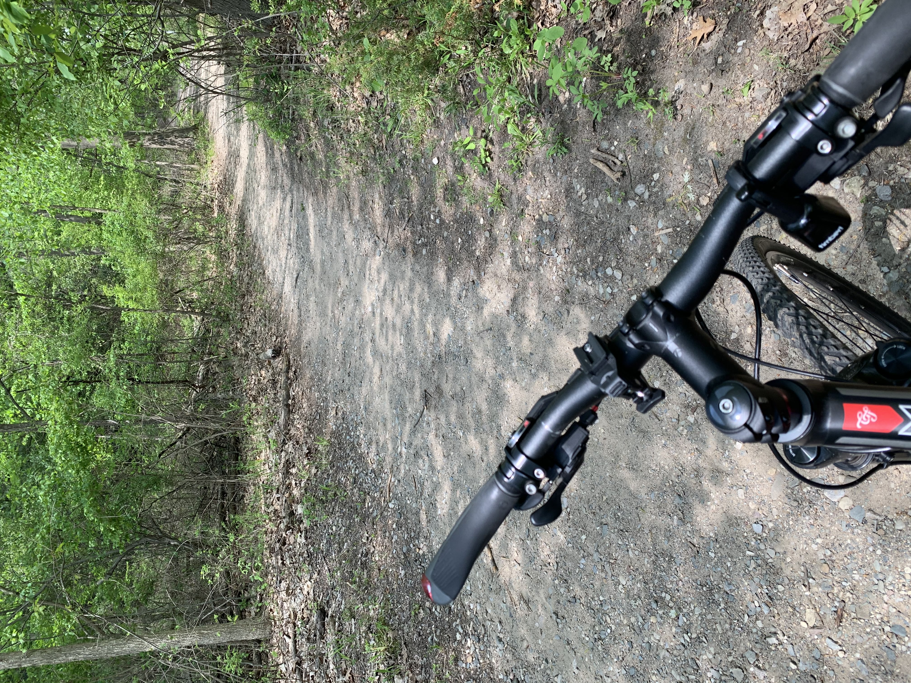
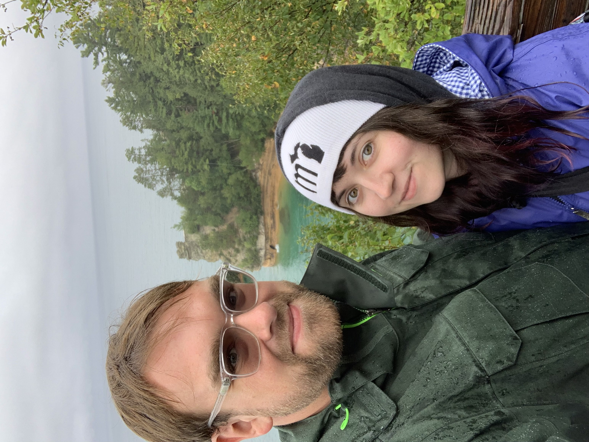

With another year in the books, it’s time to reflect on what happened in 2021. It’s crazy to think of how quickly this year has gone by; it feels like it just started!

The second year of navigating through a pandemic has been rough. I’ve still been battling with anxiety issues, feeling overwhelmed, stressed, and getting burned out quickly. I started meditating a few times a week and adding in more exercise, which has helped immensely, but there’s still a lot of work for me to do. I also need to remember to reach out to all my peers and regularly check-in, instead of being a hermit.

Career-wise I feel like I’ve grown a lot as a designer. In February, I got to join the incredible team at [Clearfire](https://clearfirestudios.com/). They are some of the best people I’ve ever gotten the chance to work with. It’s been a fun challenge to focus on a wide variety of marketing sites and web apps rather than the enterprise applications for the automotive industry that I’m used to. It’s also refreshing to work with a team with dynamically different skill-sets, where we work together to build awesome web experiences primarily around my favorite content management system, [Craft CMS](https://craftcms.com/). Over the year, the team and I have worked together to help streamline an efficient design to development handoff process for different types of projects.

This year, I also got to go to my first ever large outdoor concert venue to see Glass Animals. Before the concert, I decided to go for a 30-mile bike ride with some friends. On the way back from the ride, my bike pedal fell off about three miles away from the car. I ended up pedaling with one foot for those last couple of miles to get back to the car in time to get to the show. I ended up getting to the venue just in time for the show to start... And the rain. The show was a lot of fun and a great experience.

Glass Animals at Michigan Lottery Amphitheater

Bike pedal came clean off. Luckily it didn’t happen when I was further out from the car.

---

## Accomplishments

Here are some of my accomplishments that helped make 2021 a good year.

### Got engaged

After five years together, Kelly and I finally got engaged on October 6th. I planned to do this last year, but things have gotten pushed back a bit with the pandemic. We kept it simple by having a nice sushi date and movie night. I was planning to propose at Shenandoah National Park but decided it should be something more personal with just us and where we could tell the news to family and friends afterward.

We got engaged!

### Went to my first National Park(s)!

After realizing I had never been to a National Park a few years ago, I made it a goal this year to at least visit one. I visited my first National Park, Shenandoah National Park, in Virginia with Kelly and some friends. We also got to check out Luray Caverns, which is something else I’ve always wanted to explore in the area. As a bonus, we also got to check out a second National Park, Cuyahoga, on the way home. During our Cuyahoga hike, there was light rain, but it was still fun. The hikes at Shenandoah were breathtaking, exactly everything I was hoping for on our trip. The first day we were there, on the most challenging hike we did, it was foggy to the point we didn’t get any views when we reached the summit. At Shenandoah, we checked out Mary’s Rock, Stony Man, and Upper Hawksbill during our visit.

Shenandoah National Park, Virginia

Kelly at Cuyahoga National Park, Ohio

### Started biking more

I tried to make it a point to become more active over the year. Biking has always been a hobby to help clear my mind and re-focus. I’ve logged over 750 miles on Strava over 2021. It’s better than some previous years, but still not where I want to be. I live a mile down the road from a park with MTB trails (Mountain Biking), and during my lunch breaks, I’ve been doing a 7-mile loop to help get me back into shape. I’ve put on a lot of weight during the pandemic, and I’ve been focusing on getting healthy and regaining energy.

Riding at the park down the street from me

Riding the Macomb Orchard Trail, Michigan

### Created a design to development workflow within Figma

My design workflow utilized many tools like Zeplin, Invision, and a few other tools to show finished mockups to developers. This process can be a bit overkill for smaller marketing sites. I worked on how everything could be designed, presented, and handed off to developers, all within Figma. Figma has been an incredible tool to work with, with a lot of flexibility. This new workflow is currently documented in a half-finished blog post coming early 2022. The gist of it is that I use tags to show the progress for a set of completed pages, then use a sticky note component to explain how things should work and my thinking. It also allows me to take notes while designing without having to leave Figma. The commenting feature in Figma is only used for design feedback and clarification from developers, not to keep so many open comments. It would be neat to have comment tagging in Figma in the future to keep design/development comments separated.

### Helped refine my UX/UI Process

I looked over my current process, and I started to create templates to work off of and checklists rather than doing everything from memory. I made a template for a UX discovery doc that covers everything from about the brand, style impressions to user personas and micro-moments. I also helped refine my information architecture document and helped refine the way the Craft CMS fields doc that I created gets made.

Being newer to Figma, I had to re-think how I worked. Figma has many neat features over using Sketch, and I wanted to utilize them to the fullest. Things like multiplayer, auto layout, a built-in presentation mode, component variants, and other small things have helped make my design process that much smoother. It took a while to get the hang of this new workflow, but it’s been for the better.

### Worked on the ability to build new habits

One issue that I faced is that I would have good intentions to build new habits but usually get overwhelmed with a routine and break it after 2-3 weeks. I also tend to focus on too many things at once instead of what’s essential. The problem is that my goals were not sustainable in the long term with the amount of effort I was exerting. I read Atomic Habits by James Clear, and it’s helped me keep my goal habits clear, easy, and *enjoyable*. I now introduce one small habit at a time and wait a few weeks before trying to introduce something new to my routine to compound onto that routine.

Before, I would get too excited with a new “habit” and go all out with it. If I were to make mountain biking 5x a week a goal, I would exert myself too hard to the point that it isn’t sustainable where I would need to take a break the next day. Now I do a more realistic goal of 20 minutes or 5 miles a day. Once I got used to these short rides, I added in some bodyweight workouts near the entrance to the park I ride at once I finish. These small incremental changes have been much more attainable and better for me in the long term.

### Reading

I have made it a goal to read at least **10 pages** per day. I used to focus strictly on the number of books I read throughout the year, but I learned to change that goal to the quality of the books and the takeaways I get from them that I can implement in my everyday life. I also started reading a few books that are just for fun in between the self-help books.

1. The Design of Everyday Things, by Don Norman
2. Designing Connected Content, by Carrie Hane and Mike Atherton
3. Shape Up, by Ryan Singer
4. Atomic Habits, by James Clear
5. Being Gary Fisher, by Gary Fisher
6. Effortless, by Greg McKeown

### Writing

This year, I have published **2 blog articles**, one talking about [plugins for Craft CMS](https://bryandugan.com/plugins-for-your-next-craft-cms-project/) and the other about [getting started with Silhouette cutting machines](https://bryandugan.com/getting-started-with-silhouette-cutting-machines/). I have about ten more half-written articles that still need to be completed. In 2022. I need to get in the habit of only focusing on writing one article at a time and getting it out there. Done is better than perfect.

---

## Places Explored

I kept traveling this year to places that are within driving distance. It doesn’t feel like I did a lot of traveling, but looking back, it was a fun year with a lot of short day or weekend trips. Here are the trips that I’ve gone on.

-   Hocking Hills, Ohio
-   Caseville, Michigan (Albert E. Sleeper State Park)
-   Grand Rapids, Michigan (Meijer sculpture Gardens)
-   Belle Isle, Michigan
-   South Haven, Michigan
-   Pictured Rocks National Lakeshore
-   Kitch-iti-kipi
-   Tahquamenon Falls
-   Cuyahoga National Park
-   Shenandoah National Park
-   Luray Caverns
-   Pittsburgh, PA

Box Hop - Hocking Hills, Ohio

Hocking Hills, Ohio

Neuron at Meijer Sculpture Garden, Grand Rapids, Michigan

SR-71 Blackbird at Air Zoo, in Kalamazoo, Michigan

Pictured Rocks, Munising, Michigan

Kitch-iti-kipi, Manistique, Michigan

---

## New Technology

Here are some tools that I ended up switching up throughout the year.

-   Switched from Sketch to [Figma](https://figma.com/) for just about everything design-related.
-   Switched from Todoist to [Things 3](https://culturedcode.com/things/) for my to-do list manager.
-   Started using the built-in Apple Calendar a lot more to keep track of personal events.

## **Goals for 2022**

For 2022, I want to focus on my essential needs. The things causing me the most issues are my own happiness and physical wellness. I plan to focus most of my energy on being happy and healthy. That involves staying active, taking more breaks, going out more on small day trips, and getting my energy back. I’m also planning on purchasing my first home later in the year. I want to be a better partner, co-worker, friend, and person. Lastly, I want to help give back to the design community more by writing more articles and resources.

Upper Tahquamenon Falls, Michigan
