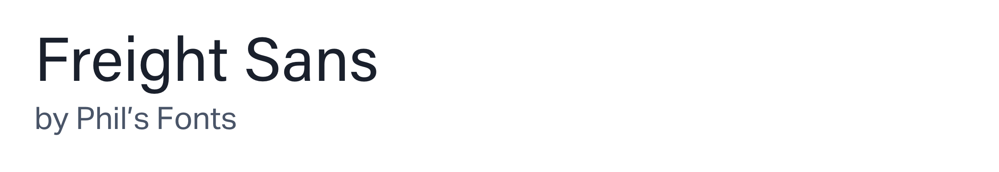
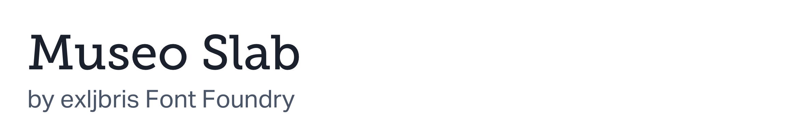

Included for free in an active Adobe Creative Cloud subscription, you can grab some pretty great premium fonts for use in commercial projects at [https://fonts.adobe.com](https://fonts.adobe.com/)

When adding fonts to a project, I recommend keeping a separate spreadsheet with a list of which websites are using Adobe Fonts and which account. That way, if the Adobe CC subscription is canceled, you'll know which websites will be reverted a fallback font.

## Headings

These headings, or otherwise known as display fonts, are great to use for headlines that will stand out at large sizes.

## Body Copy

Body copy should be legible while reading large blocks of text. Some of the fonts listed in this section could also work as a headline but may not be as effective.

## Multipurpose

These fonts are usually my go-to fonts as they not only look great at multiple sizes and weights but also complement each other perfectly. When in doubt, choosing one of these fonts is always a safe bet.

