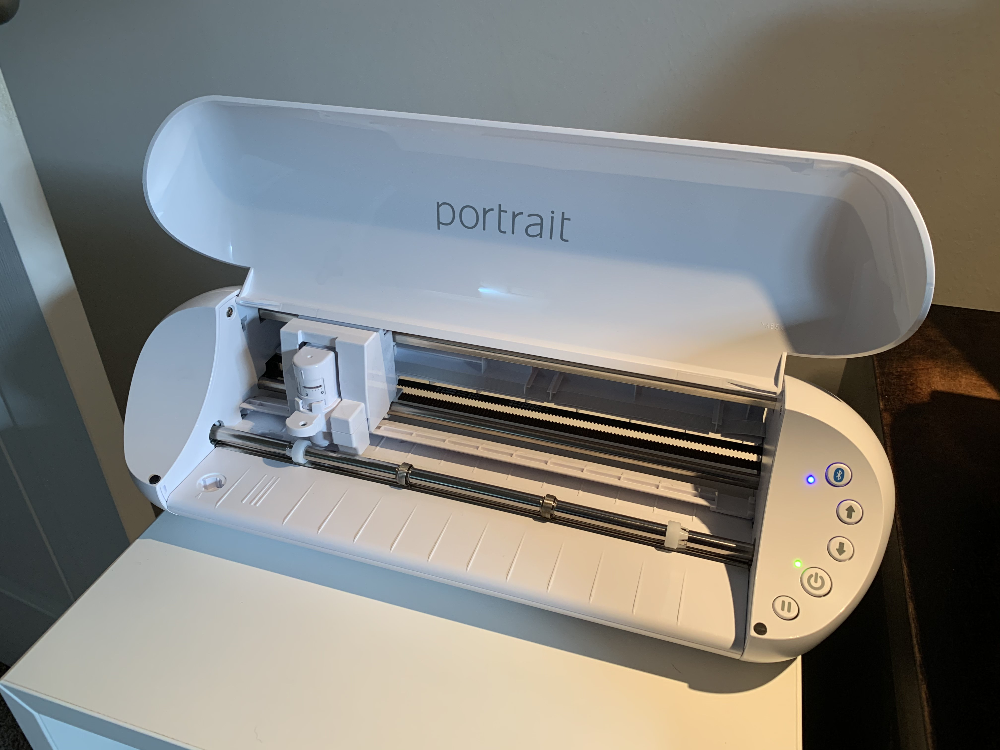
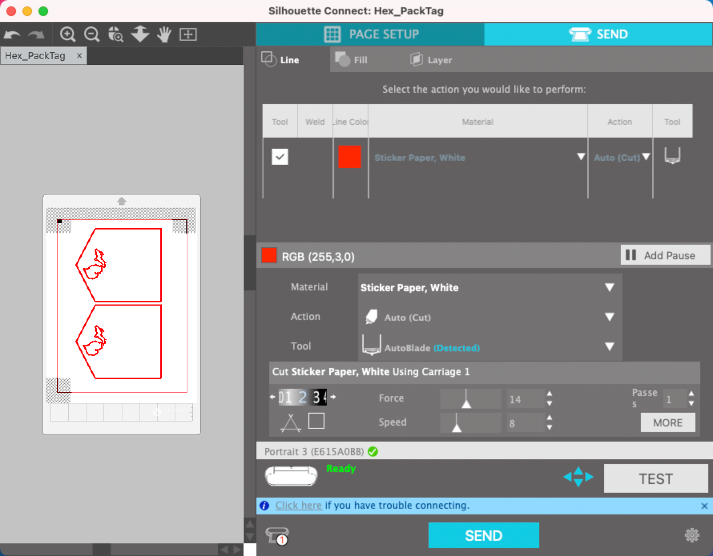
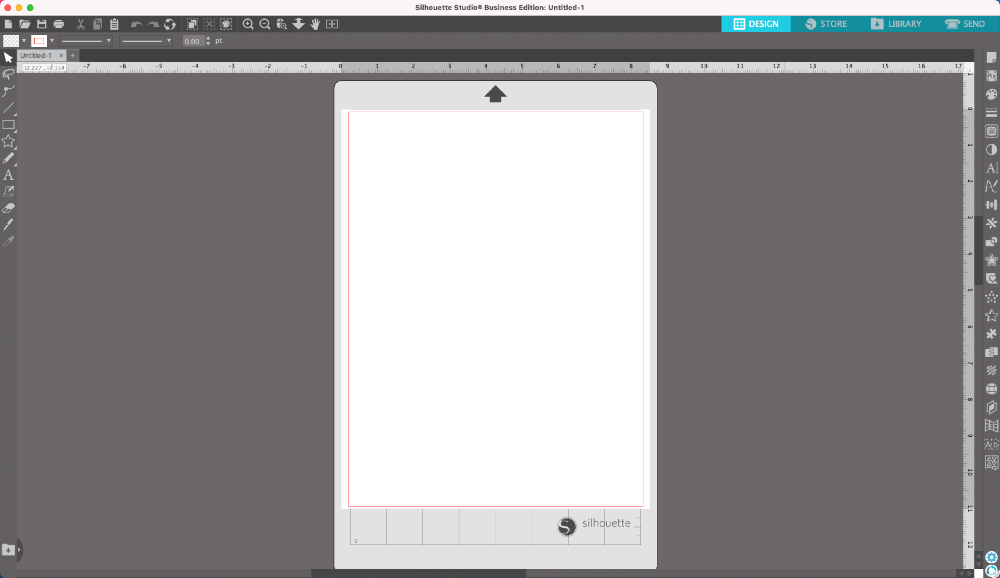
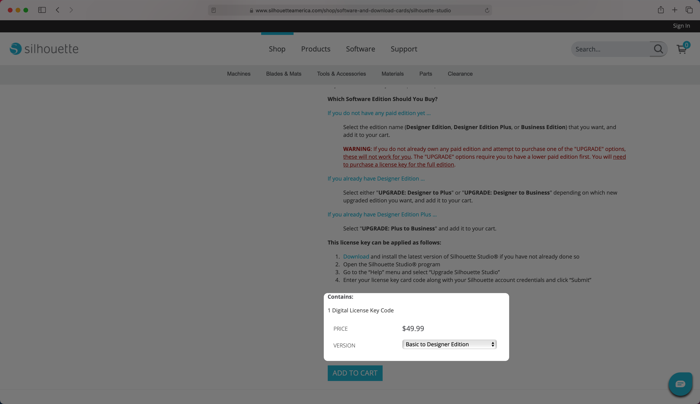
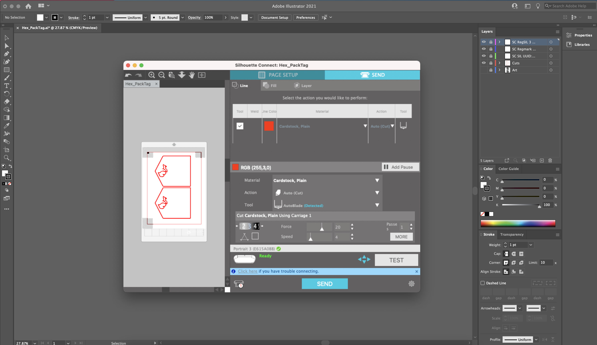
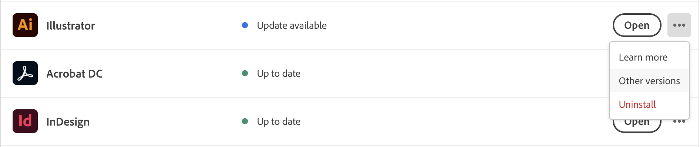
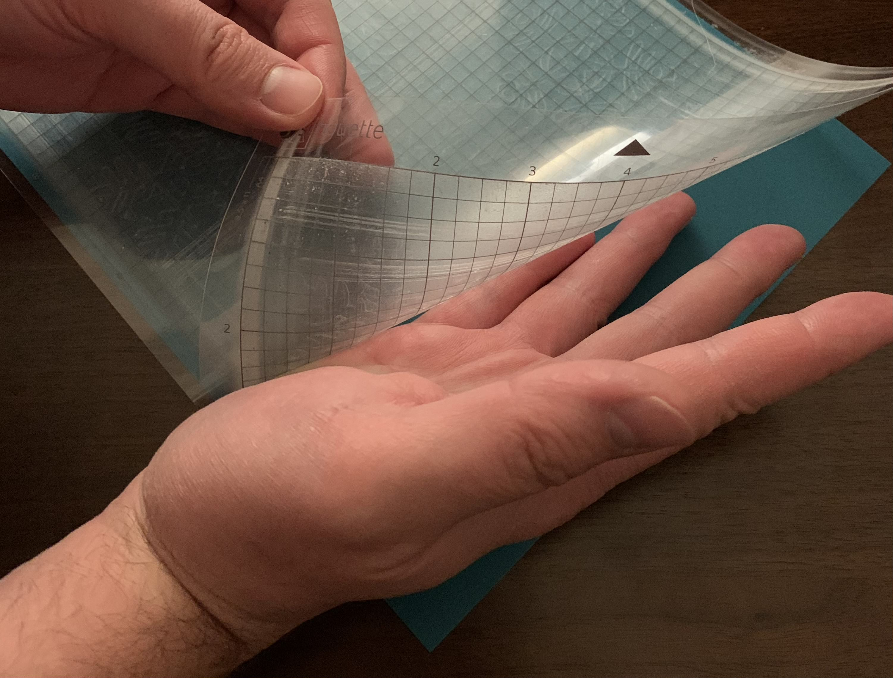
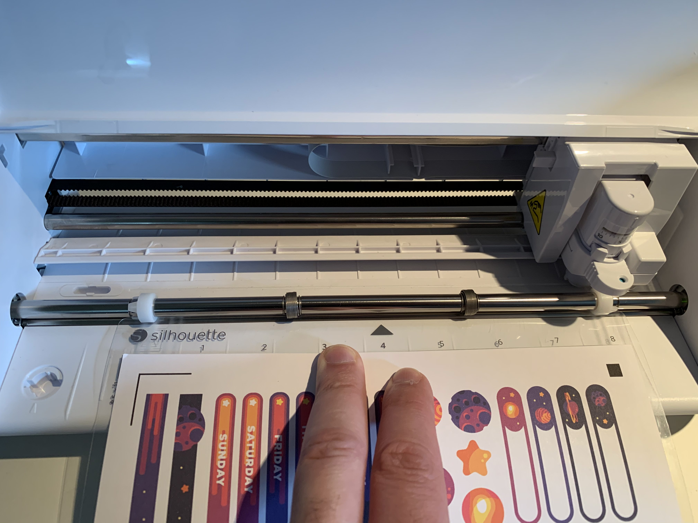

My partner, [Kelly](https://kellyhalloran.com/), runs the Etsy shop [Wildwood Owl](http://wildwoodowl.com/) and we wanted to learn how to create cards, vinyl cutouts, and sticker sheets. With both of us having a design background, we thought it would be a fun side hobby for us to do together.

It took a lot of trial and error learning about the Silhouette ecosystem and getting it set up and working. So, we thought it would be great to document our entire experience to help others that are just getting started. This article will go over our impressions of Silhouette, what you need to get started, and the software that works best for what you're trying to achieve.

---

## Impressions on Silhouette

We researched multiple popular cutting machines and found that Silhouette has more accurate cuts and software geared towards advanced users who want full control. While trying out test cuts, we found this statement to be entirely accurate. They throw the kitchen sink at you, and the cuts and presets work exceptionally well.

We have been using the Silhouette for a few months and found that the pros outweighed the cons for our particular needs. Here are our findings of what we liked and didn't like.

### Silhouette Pros

1. Most accurate cuts of any machine we've tried (We mainly compared Silhouette to Cricut).
2. Allows you to set cut lines and work directly in Adobe Illustrator with the Silhouette Connect plugin.
3. Silhouette Studio has plenty of neat features for crafty individuals that don't already use Illustrator.
4. The machine looks and functions great.
5. Parts are available at our local craft store.
6. Silhouette has a lot of cutting presets for different materials that work well for getting started.
7. Some cutting materials websites have recommended Silhouette cutting depths listed to help save time.
8. The Silhouette's auto blade allows for multiple cut depths in the same cut job. Having multiple cut depths is especially useful for creating sticker sheets where you need a sticker kiss cut and sheet cut depth.
9. The Silhouette team takes feedback seriously when you suggest features for the software.
10. A single software license work on up to 3 computers.

### Silhouette Cons

1. The software is horrible from a user experience standpoint. It could use a complete rebuild that's easier to navigate and runs faster.
2. Their website has many issues, such as randomly clearing forms or flagging my credit card with any purchase.
3. Silhouette Connect software updates may take 2-6 months to become compatible with Illustrator's newest major releases.
4. Silhouette's support is helpful, but they recently have been swamped with a massive influx of users, and ticket updates may take weeks for a response.

Overall, we researched multiple popular cutting machines and found that Silhouette has the most accurate cuts and has software geared towards advanced users that want complete control over their designs. Silhouette's software is loaded with features, and the cuts and presets work exceptionally well.

However, I'll also say that their overall user experience is awful, from using their website to their software. It feels "overly engineered," with requested features thrown on without a second thought on user experience or performance. The software is also not retina-ready in some parts, leaving parts of the interface blurry. All in all, the machine itself is excellent, though the software leaves much to be desired. With the increase in the cutting machine's popularity, I can see the Silhouette team investing more into the software in future releases.

---

## Getting started with the Silhouette ecosystem

Now that we went over our entire experience with Silhouette and you're ready to jump in, here is everything you'll need to get started.

1. **[Silhouette Portrait 3 machine](https://amzn.to/2IEE3qD)** — This is a great entry-level cutting machine perfect for 8"x11" in sheet cuts. If you need a larger cutting area or wish to cut many different materials ([click here to see the complete list](https://www.silhouette101.com/archives/materials-guide)), we recommend the [Cameo 4](https://www.amazon.com/Silhouette-Bluetooth-Cutting-Autoblade-Software/dp/B07VLB3627).
2. **Silhouette Software** — There are two main pieces of software to get you started with the Silhouette ecosystem. Choose the one that suits your needs the best.
    1. **[Silhouette Studio](https://www.silhouetteamerica.com/software#silhouette-studio)** — Silhouette has their software suite with different versions depending on your needs (we recommend getting the Designer edition or above). [Learn about and purchase the different versions here](https://www.silhouetteamerica.com/shop/software-and-download-cards/silhouette-studio). Silhouette Studio is geared towards users who want to buy pre-made designs through their [design store](https://www.silhouettedesignstore.com/) or [Etsy](https://www.etsy.com/search?q=svg%20files%20for%20silhouette&ref=auto-1), are new to creative software, or wish to have a low-cost entry point for creating designs and cuts.
    2. **[Silhouette Connect](https://www.silhouetteamerica.com/software#silhouette-connect)** — This is a plugin for Adobe Illustrator (and Corel Draw) used to set registration marks, cut lines, and send jobs to the cutting machine (this is what we use).
3. **Printer** — If you don't have a good quality printer, we highly recommend the [Canon IP8720](https://amzn.to/2ICTU8M). It's an excellent entry-level budget professional printer that prints large scale and high quality for the price. Having a large format printer is especially helpful if you get the Silhouette Cameo machine to cut larger designs.
4. **Scraper and Spatula tool** (optional) — A scraper is nice to have, especially with a new mat to rub stuck paper bits off and help vinyl stick to the transfer tape. The spatula tool is for taking off multiple stickers cut into sections. We have the [Cricut scraper and spatula set](https://amzn.to/3nlip9w), which seems to do the job just fine.
5. **[X-Acto Knife](https://www.amazon.com/X-ACTO-2-Knife-Safety-Cap/dp/B000V1QV7O/)** (optional) — If you have to lift detailed cuts off the mat, an X-Acto blade will help pick up those fine details. Using an X-Acto blade proves to be especially helpful when working with vinyl.
6. **A second cutting mat** (optional) — If you're planning on cutting larger volumes, it's helpful to have a second cutting mat to speed up the process. As soon as one sheet is done, load the other one into the Silhouette, and while the second sheet is cutting, prep the first mat to be ready to go again.

---

## Silhouette software

There are two main pieces of software for the Silhouette cutting machines, depending on your needs. First, there's Silhouette Studio, a full-service design and cut program that lets you create your own designs or import other artwork. Then, there's Silhouette Connect, a plugin for Adobe Illustrator (or Corel Draw) that allows you to send cut jobs to the machine through Illustrator directly.

### Silhouette Studio

Silhouette Studio is a free (to \$100) piece of software for macOS/Windows that comes bundled with the Silhouette machine. It can do just about everything you need to get started with creating designs for the Silhouette. This option is perfect for regular users who don't use the Adobe Creative Suite. A single Silhouette Studio license key can also work on up to 3 computers.

Many users like to purchase pre-made designs by downloading the SVG (Scalable Vector Graphic) format file off [Etsy](https://www.etsy.com/search?q=svg%20files%20for%20silhouette&ref=auto-1) or other websites. If that's what you plan on doing, you will need at least the [Silhouette Studio Designer Edition](https://www.silhouetteamerica.com/shop/software-and-download-cards/silhouette-studio) (\$50) to support importing SVG files. SVG's are a file format (like PNG, JPG, PDF, or GIF) that is vector-based, which means that you can make the artwork as large or small as you would like without losing image quality.

We tried out Silhouette Studio and decided it was not for us, but we can see how it could benefit crafty people that are new to vector design software with a point of entry cost.

**Setting up Silhouette Studio**

1. [Purchase the edition of Silhouette Studio](https://www.silhouetteamerica.com/shop/software-and-download-cards/silhouette-studio) that is right for you (We recommend getting Designer edition or higher)
2. [Download Silhouette Studio](https://www.silhouetteamerica.com/software#silhouette-studio) for your operating system.
3. Enter the license key.

### Silhouette Connect

If you already use Adobe Illustrator or Corel Draw in your daily workflow, Silhouette Connect is your best bet. Think of Silhouette Connect as the print dialog window for the Silhouette machine. You'll use Illustrator to designate where you want the cuts and use Silhouette Connect to set up your registration marks and send them to the cutting machine. A single Silhouette Connect license key works for up to 3 computers.

**Setting up Silhouette Connect**

1. Purchase a [Silhouette Connect License Key](https://www.silhouetteamerica.com/shop/software-and-download-cards/silhouette-connect-items).
2. [Download the Silhouette Connect](https://www.silhouetteamerica.com/software#silhouette-connect) software for your operating system.
3. Enter the license key to register.
4. Once installed, you should see an option under "File" in Illustrator called "Silhouette Connect." If you don't see the option after it's installed, then your version currently isn't supported, and you may need to have multiple versions of Illustrator installed.

**IMPORTANT:** Don't upgrade your version of Illustrator version as soon as a new version comes out. Silhouette won't support it for at least a few months after a new release. Be sure to keep an eye out for the Silhouette beta software to see if/when it's available. Check the [release notes](https://www.silhouetteamerica.com/software#silhouette-connect) to see whether or not it's compatible. You may also have to keep a separate install on your machine of an older version of Illustrator if you regularly update your apps. Silhouette Connect should work with Illustrator's patch updates but may not work for minor releases. Major releases of Illustrator may take months to be compatible with Silhouette Connect.

**For example**

**_Illustrator v 25.2.1_**

-   25 = Major — Will not work as soon as an update is released.
-   2 = Minor — May work when an update is released.
-   1 = Patch — Should work when an update is released.

**Installing multiple versions of Illustrator**

If you update Illustrator and don't see "Silhouette Connect" from the File window, your Illustrator version is not compatible. You can roll back Illustrator to a previous version by opening up Creative Cloud and going to the "All apps" page. Click on the ... icon next to "Open" and select "Other versions." You may have multiple versions of Illustrator installed and use one for your regular work and the older version just for creating and cutting designs in Silhouette. Don't make changes to your Silhouette documents in the new version of Illustrator since new versions are not backward compatible.

---

## Setting up the Silhouette Machine

Now that you have everything that you need to get started with the Silhouette ecosystem, here are some tips we found to be successful, along with Silhouette's regular setup instructions.

### **Tips for creating successful cuts with the Silhouette machine**

-   The cutting mat, right from the factory, is way too sticky. We recommend sticking it to your shirt a few times to get some lint on it to make the artwork easier to peel off. Don't worry; it's still really sticky, and you should get around 100 or so cuts with it before needing to be replaced, depending on usage.
-   Place the machine away from the wall a little bit. The paper will feed through the back of the unit by at least one foot. The Portrait 3 can cut materials up to 8inx60ft, though you'll most likely be using 8.5x11in paper/vinyl most of the time.
-   After using the cutting mat, always put the blue film back on it to keep it protected.
-   Practice with copy paper before using more expensive materials (When cutting, select the "Copy Paper, 80lb" preset).
-   Depending on the sharpness of the blade, different cut depths and force may need to be adjusted. Make sure the cut works using the "Test Cut" option.
-   We recommend setting the machine up to Bluetooth for the best possible cutting experience. You can connect only one computer to a machine via Bluetooth at once. So if you need, you'll have to close the Silhouette software on the other device before connecting to a new computer.
-   When taking the artwork off the cutting mat after cutting, keep the paper side down on the table and roll it off the cutting mat with your hands to avoid the paper from curling. Don't be afraid to curl the plastic mat in the process, as they are durable.

-   When cutting, use the second from the left line to feed in your materials.

