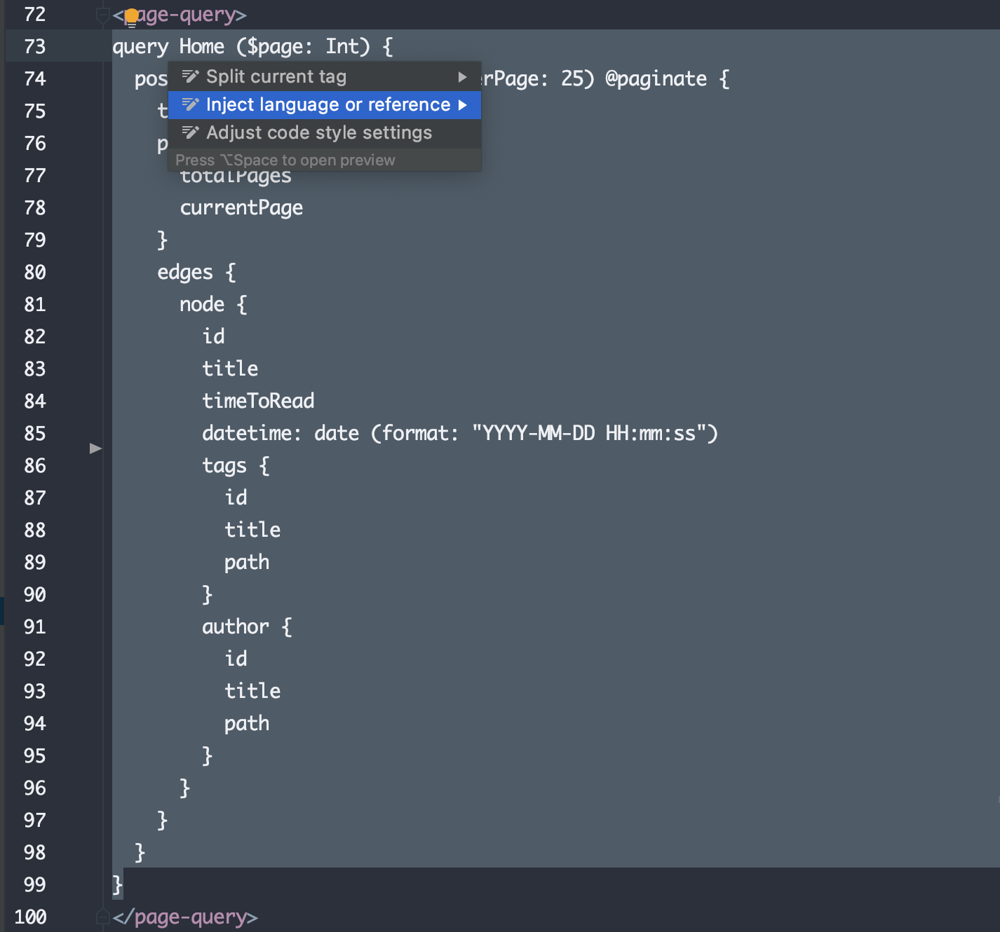

PHPStorm is an IDE (integrated development environment) code editor. Most everything you'll need is built right into the editor without needing to mess around with minimum configuration. As a bonus, most language support and development tools are developed and maintained by PhpStorm's author JetBrains. If you're regularly developing websites and web-apps, I highly recommend using PhpStorm and JetBrains products in general.

While it lacks a simplistic minimal UI, it makes up for it with its incredible feature set and ability to quickly navigate around your code. Everything you'll need to be successful with development works right out of the box, and you can fine-tune everything to your specific liking.

This article will go over the essentials for getting started, including PhpStorm vs. WebStorm, common keyboard shortcuts, language injection, themes, and plugins.

### PhpStorm vs. WebStorm

If you already have PhpStorm installed, feel free to skip over this section.

The main two tools for web development that JetBrains produces is [PhpStorm](https://www.jetbrains.com/phpstorm/) and [WebStorm](https://www.jetbrains.com/webstorm/). PhpStorm and WebStorm have the same feature set, other than the fact PhpStorm has syntax support for PHP. PHP syntax support will come in handy if you ever need to work with Craft CMS, WordPress, Laravel, or other PHP based CMS's and frameworks. If you open up a PHP file in WebStorm, you don't get syntax highlighting, auto-formatting, and the file opens as a plain text file, so I'd recommend getting PhpStorm just in case.

Both PhpStorm and WebStorm have a yearly subscription fee, although if you were to cancel, you could keep using the last version of the software before it expired. The subscription fee may seem like a lot, especially if you come from free tools such as VSCode, Sublime Text, or Atom, but it's completely worth every penny with how quickly you can get up and running. Also, most of the tools are built and maintained by JetBrains, so you have to worry about third-party tools no longer being supported. Right out of the box, you'll have just about every feature you'll need other than customizing the interface to make it yours.

> The way I look at it is if you use a tool regularly, and it makes your life easier, it's worth the subscription fee.

### PhpStorm shortcuts

Learning the most used shortcuts is the first thing I like to do while learning a new application. Here are the most common ones that I use regularly.

| Action | Shortcut |
| :--- | :--- |
| Format code | `cmd` + `shift` + `l` |
| Find | `cmd` + `f` |
| Find & replace | `cmd` + `r` |
| Go to next tab | `cmd` + `shift` + `[` or `]`|
| Search everywhere | `shift` + `shift` |
| Safe delete | `cmd` + `delete` |
| Find in path | `cmd` + `shift` +`f`|
| Find & replace in path | `cmd` + `shift` +`r` |
| Duplicate line | `shift` + `d` |
| Move to next/previous word/line | `option` + `left` or `right` |
| Select next/previous line | `option` + `up` or `down` |
| Move line up/down | `shift` + `option` + `up` or `down` |
| Move to matching div | `ctrl` + `m` |
| Go to definition | `cmd` + `left click` |

## Language injection

Out of the box, PHPStorm works with most languages. However, I've noticed that writing another language such as GraphQL inside `<page-query>` tags in a Vue Gridsome file or using the `` or `` tags inside Craft CMS Twig templates that there is no syntax highlighting.

To remedy this, you'll need to do something called language injection. ****You will only have to do this once; then, all your files will support that particular language injection.

To inject a language, select the code, click the lightbulb icon 💡, and select "inject language or reference." If the lightbulb isn't showing, you can right-click and choose "Show Context Actions" to get the dialog to show.

## Themes

PHPStorm comes with a few basic themes to get started. However, most people like installing a different theme. I prefer dark themes for my code editor, so I can't give any recommendations to any light themes. If you have any favorites that you recommend, feel free to send me a DM on Twitter [@bryandugan](https://twitter.com/bryandugan), and I'll add a few here.

[**Material Theme →**](https://plugins.jetbrains.com/plugin/8006-material-theme-ui)

The Material Theme has quickly become extremely popular among popular code editors. Instead of only changing the color scheme, unlike all the other themes in this list, it takes over the full IDE and changes icons and the entire application's look and feel to match Google's Material design spec. You may also use the Material theme along with any of the color schemes in this list.

[**Base16 Ocean →**](http://color-themes.com/?view=theme&id=563a1a7880b4acf11273ae9b)

A theme that I have been using off and on for years is the Base16 Ocean Theme. To me, it's easy to read and navigate and is one of my all-time favorites.

[**Monocai →**](https://plugins.jetbrains.com/plugin/12163-monocai-color-theme)

A dark theme based on the default color scheme Monakai for Sublime Text.

[**Night Owl →**](https://plugins.jetbrains.com/plugin/10936-night-owl-theme)

A dark theme perfect for night owls inspired by Sarah Drasner's theme for VSCode.

[**Cobalt 2 →**](https://plugins.jetbrains.com/plugin/10745-cobalt-2)

A dark blue color theme based upon Wes Bos' popular Cobalt 2 theme for VSCode.

[**One Dark Theme →**](https://plugins.jetbrains.com/plugin/11938-one-dark-theme)

A dark theme based on Atom's default bundled One Dark theme.

### Finding color themes

Here are some resources that I look to if I'm looking for a new theme for PhpStorm.

- [https://plugins.jetbrains.com/search](https://plugins.jetbrains.com/search)
- [http://color-themes.com/](http://color-themes.com/)

## Plugins

PhpStorm doesn't require many plugins to get you started since most of what you need is already built-in. However, there are a few plugins that I have added along the way to better support my workflow.

[**.env files support →**](https://plugins.jetbrains.com/plugin/9525--env-files-support)

Adds support for .env files.

[**.ignore →**](https://plugins.jetbrains.com/plugin/7495--ignore)

Adds support for .ignore files.

[**JS GraphQL →**](https://jimkyndemeyer.github.io/js-graphql-intellij-plugin/)

Adds support for GraphQL files.

[**PostCSS →**](https://plugins.jetbrains.com/plugin/8578-postcss)

Adds support for PostCSS files.

[**Rainbow Brackets →**](https://plugins.jetbrains.com/plugin/10080-rainbow-brackets)

Changes the colors of matching parenthesis and brackets.

[**Tailwind CSS →**](https://plugins.jetbrains.com/plugin/15321-tailwind-css)

Adds support for the Tailwind CSS framework.

[**Tailwind Formatter →**](https://plugins.jetbrains.com/plugin/13376-tailwind-formatter)

Automatically formats and organizes TailwindCSS classes in your files.

[**Yii2 Inspections →**](https://plugins.jetbrains.com/plugin/9400-yii2-inspections)

Yii 2 and Craft CMS 3 inspections.

### Finding additional plugins

To find additional plugins, you can access the Plugin Marketplace by either the [marketplace website](https://plugins.jetbrains.com/phpstorm) or within PhpStorm by navigating to `PhpStorm > Preferences > Plugins` and selecting Marketplace from the top bar.
