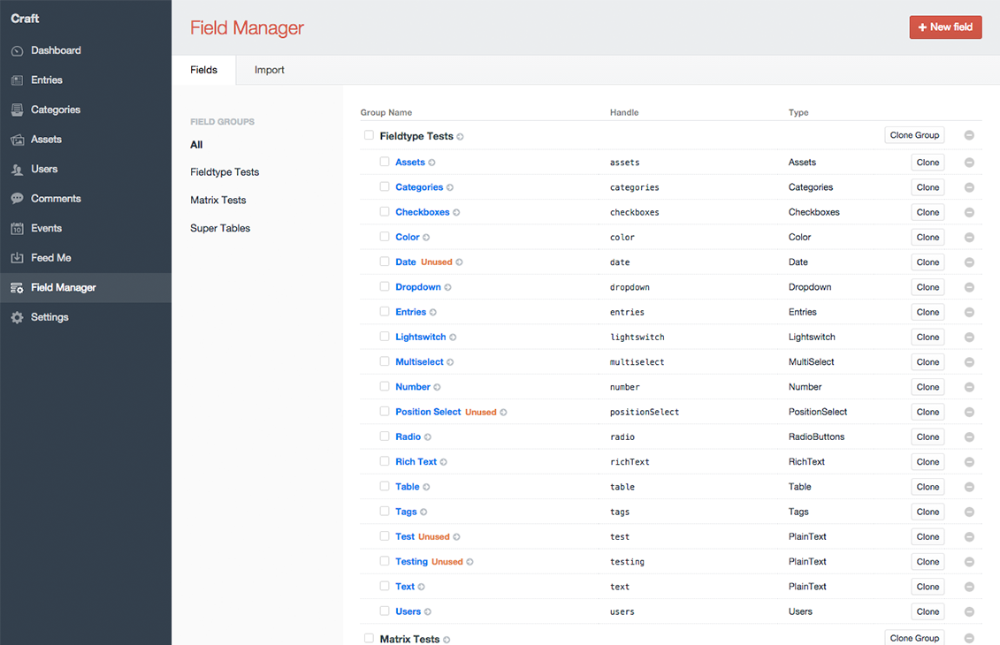
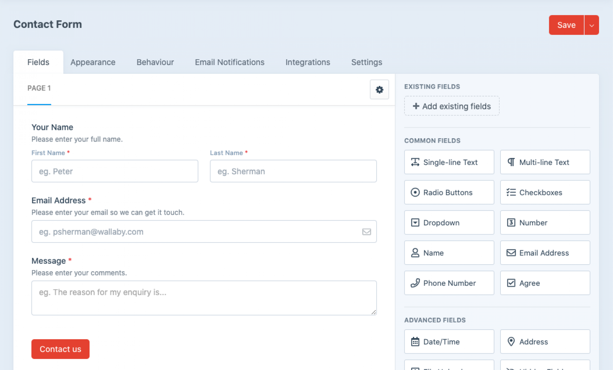
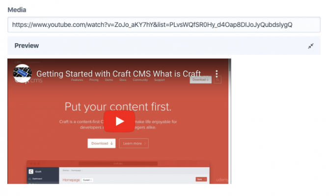
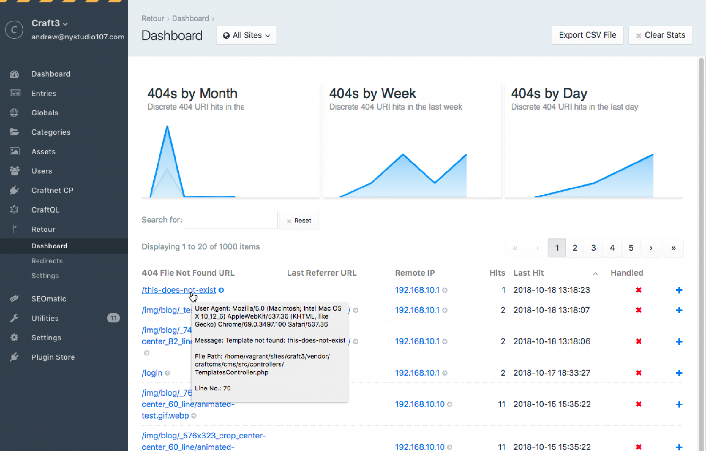
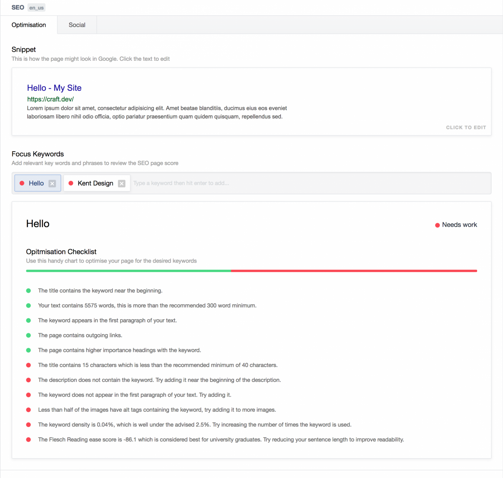
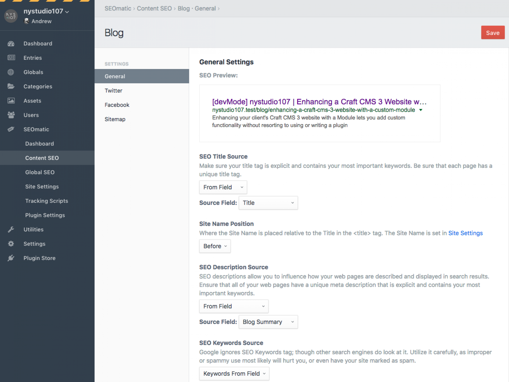
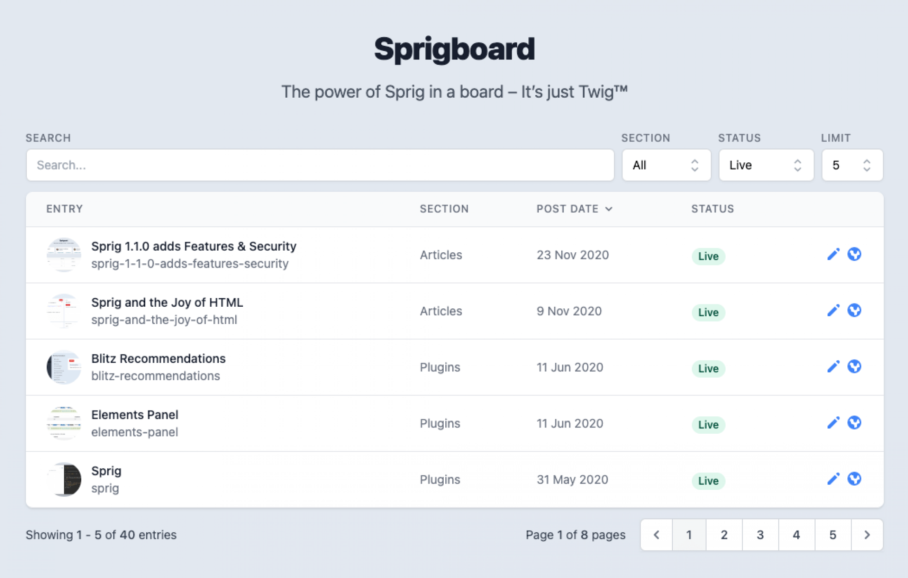
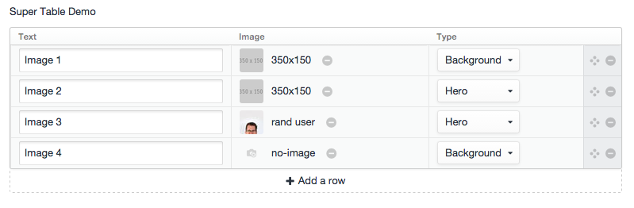
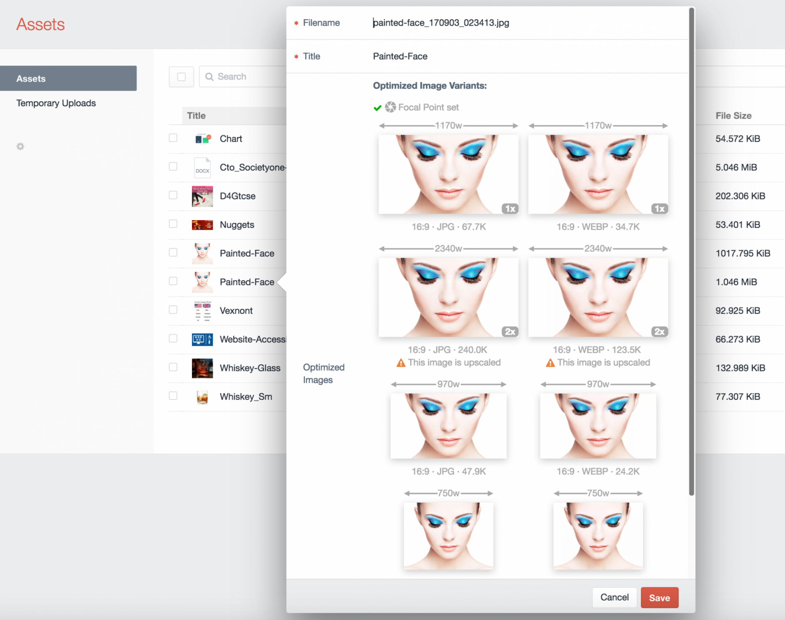

Out of the box, Craft CMS is a powerful platform. However, there are plenty of powerful plugins for Craft that handle particular tasks you may need for your website. Here is a list of Craft plugins that I reach for when building a new website or webapp. Use this list as a starting point for your Craft boilerplate or to learn about different available plugins.

---

### Feed Me

If you're planning on migrating a large site to Craft with many pages or blog posts, Feed Me helps make the process a little bit easier. Feed Me allows you to import data all at once or run the plug at regular intervals. The plugin is maintained by Pixel & Tonic, the creators of Craft CMS. It allows you to pull in data via JSON, XML, CSV, and other feeds.

**Resources for Feed Me**

-   [Get Feed Me on the Craft Plugin Store](https://plugins.craftcms.com/feed-me) (Free)
-   [Documentation](https://docs.craftcms.com/feed-me/v4/)

---

### Field Manager

Field Manager is a great plugin to use while setting up all your CMS fields. It allows you to duplicate fields and shows which fields are not used for a bit of housekeeping.

**Resources for Field Manager**

-   [Get Field Manager on the Craft Plugin Store](https://plugins.craftcms.com/field-manager) (Free)
-   [Documentation](https://verbb.io/craft-plugins/field-manager/docs/get-started/installation-setup)

---

### Formie

Formie is my go-to form plugin for Craft. It is one of the newer form builders, but is feature heavy with over 25 field types, drag & drop form builder, allows users to sign-up to all the popular Email marketing platforms, enter user data into CRM's, spam protection, API integration, and much more.

**Resources for Formie**

-   [Get Formie on the Craft Plugin Store](https://plugins.craftcms.com/formie) (Paid)
-   [Documentation](https://verbb.io/craft-plugins/formie/docs/get-started/installation-setup)

---

### Mailgun

I don't like to rely on my VPS to send emails and instead trust using the Mailgun service for better email delivery. The Mailgun plugin allows you to connect Mailgun services to your Craft website quickly. This plugin is also a first-party plugin by Pixel & Tonic, the creators of Craft CMS.

**Resources for Mailgun**

-   [Get Mailgun on the Craft Plugin Store](https://plugins.craftcms.com/mailgun) (Free)
-   [Documentation](https://github.com/craftcms/mailgun)

---

### Maps

Maps adds a map field to Craft CMS without the need for any additional setup or API tokens.

**Resources for Maps**

-   [Get Maps on the Craft Plugin Store](https://plugins.craftcms.com/simplemap) (Free/Paid)
-   [Documentation](https://docs.ethercreative.co.uk/maps/)

---

### oEmbed

Embed media from YouTube, Vimeo, Google Maps, Facebook, Twitter, and any other website that supports the oEmbed format. An inline preview of the video allows you to make sure it is embedded correctly.

**Resources for oEmbed**

-   [Get oEmbed on the Craft Plugin Store](https://plugins.craftcms.com/oembed) (Free)
-   [Documentation](https://github.com/wrav/oembed/blob/master/README.md)

---

### Retour

When running larger websites or doing a website refresh, it's necessary to keep track of where your users are visiting and the pages they go to that no longer exist. Retour keeps track of 404 page URLs and displays which pages need a redirect. The plugin also helps redirect legacy URLs so that you don't lose SEO value while re-structuring a website.

**Resources for Retour**

-   [Get Retour on the Craft Plugin Store](https://plugins.craftcms.com/retour) (Paid)
-   [Documentation](https://nystudio107.com/docs/retour)

---

### SEO

If you're working on a website where SEO doesn't matter as much or are working on a small personal project with little to no budget, SEO is an excellent alternative to SEOMatic. It provides all the essential fields, such as meta titles, descriptions, keywords, and social media sharing banners, to handle all your basic SEO needs.

**Resources for SEO**

-   [Get SEO on the Craft Plugin Store](https://plugins.craftcms.com/seo) (Free)
-   [Documentation](https://github.com/ethercreative/seo)

---

### SEOMatic

One of the first plugins that I reach for when building a new Craft site is SEOMatic. SEOMatic is one of the best and most well-thought-out SEO plugins of any CMS platform I've used. If your website needs to be found by search engines, this plugin is a must-have! SEOMatic makes it easier to set up complex SEO fields with a helpful walkthrough and chart that shows progress.

**Resources for SEOMatic**

-   [Get SEOMatic on the Craft Plugin Store](https://plugins.craftcms.com/seomatic) (Paid)
-   [Documentation](https://nystudio107.com/docs/seomatic)

---

### Sprig

Sprig solves common JavaScript use cases for creating reactive components without the need for a page refresh. It handles things like Live search, loading additional elements, paginate, ordering, filtering, adding items to a cart, or submitting contact forms. The documentation is easy to follow and provides examples on how to set up each component.

**Resources for Sprig**

-   [Get Sprig on the Craft Plugin Store](https://plugins.craftcms.com/sprig) (Free)
-   [Documentation](https://putyourlightson.com/plugins/sprig)

---

### Sprout Encode Email

Placing a direct email address on your website is never a good idea unless you want spambots harvesting the data. If you would like to avoid spambots pulling email addresses directly from email text and links, Sprout Encode Email is a must-have. It uses the [ROT13](https://en.wikipedia.org/wiki/ROT13) filter to encode plain text Emails to make it so spambots can't easily pull the email addresses listed.

**Resources for Sprout Encode Email**

-   [Get Sprout Encode Email on the Craft Plugin Store](https://plugins.craftcms.com/sprout-encode-email) (Free)
-   [Documentation](https://sprout.barrelstrengthdesign.com/docs/)

---

### Super Table

Supercharge your tables in Craft with Super Table. Super Table allows you to use any Craft field type in your tables, including Assets, Users, Entries, and Matrix. The plugin also has support for popular third-party field types. This plugin is a must-have if you're planning on creating any content builders or handling large amounts of data.

**Resources for Super Table**

-   [Get Super Table on the Craft Plugin Store](https://plugins.craftcms.com/super-table) (Free)
-   [Documentation](https://verbb.io/craft-plugins/super-table/docs/get-started/installation-setup)

---

### Transcoder

Are you working with a site that requires multiple uploaded video banners controlled by the client? Transcoder is a must-have. Transcoder allows you to encode video and audio files on your server using the popular FFmpeg library. Transcoder also provides the auto-generation of thumbnail images from the uploaded video to use as a placeholder.

**Resources for Transcoder**

-   [Get Transcoder on the Craft Plugin Store](https://plugins.craftcms.com/transcoder) (Paid)
-   [Documentation](https://nystudio107.com/docs/transcoder)
-   [Getting started with Transcoder for Craft CMS](https://bryandugan.com/getting-started-with-transcoder-for-craft-cms/)

---

### Twigpack

I currently use a modified version of the [Craft Vue Tailwind](https://github.com/chasegiunta/craft-vue-tailwind) starter boilerplate by [Chase Giunta](https://chasegiunta.com/) for all my Craft CMS projects to get myself up and running as quickly as possible. Included in the boilerplate is a Webpack configuration that allows for HMR (hot module reloading), which watches for changes to Twig files and your CSS and JS resources. This plugin is a must-have if you're working with any Webpack.

**Resources for Twigpack**

-   [Get Twigpack on the Craft Plugin Store](https://plugins.craftcms.com/twigpack) (Free)
-   [Documentation](https://nystudio107.com/docs/twigpack)

---

### Typogrify

Good typography not only makes a website look better, but it makes content easier to digest, leaving the user with a better overall experience. Any text block that I create in Craft uses the Typogrify plugin. There's a configuration file included that allows you to customize how the copy reacts on the page.

**Resources for Typogrify**

-   [Get Typogrify on the Craft Plugin Store](https://plugins.craftcms.com/typogrify) (Free)
-   [Documentation](https://nystudio107.com/docs/typogrify)

---

### Wheel Form

Wheel Form is a free alternative to Formie for creating drag & drop forms. The plugin does a decent job creating contact forms with fundamental name/email/phone/message fields and not a lot of complexity. Wheel Form also features a basic anti-spam. It's my go-to free contact form plugin for small marketing sites.

**Resources for Wheel Form**

-   [Get Wheel Form on the Craft Plugin Store](https://plugins.craftcms.com/wheelform) (Free)
-   [Documentation](https://github.com/xpertbot/craft-wheelform/blob/master/README.md)

---

## Interesting Finds

Every once in a while, I like to browse through the Craft Plugin store to see what's new. These are some other plugins that caught my eye and would be helpful for future projects.

### Cookie Consent Banner

If you're making any sales in Europe or get regular traffic from the region, you must place a cookie consent banner on your website. It's also just good practice, in general, to let your users know what data you're collecting from them. This plugin will place a banner on your website to customize the banner's appearance and functionality.

**Resources for Cookie Consent Banner**

-   [Get Cookie Consent Banner on the Craft Plugin Store](https://plugins.craftcms.com/cookie-consent-banner) (Free)
-   [Documentation](https://github.com/a-digital/cookie-consent-banner/blob/master/README.md)

---

### Google Maps

Google Maps is a powerful plugin that allows you to handle complex visualization with Google Maps. Use it to display a single location or many locations filtered by distance from your IP address.

[Matt Everson](https://twitter.com/matt_everson/status/1369294123052765193) mentioned another great use for the Google Maps plugin:

> "Even when you don't need visual maps outright, it's the best way to manage address data for any larger swath of locations because of both search and parsability."
>
> "As an example, trade show events. Admin can search for the venue and easily save full address information, while dev has a nice set of structured data to expand functionality or sort as needed in the future."

**Resources for Google Maps**

-   [Get Google Maps on the Craft Plugin Store](https://plugins.craftcms.com/google-maps) (Paid)
-   [Documentation](https://plugins.doublesecretagency.com/google-maps/)

---

### ImageOptimize

ImageOptimize looks like a great alternative to the popular Imager plugin that was deprecated in 2019. It leverages the native Craft image UI/UX to create the image transforms. ImageOptimize handles the rest behind the scenes. ImageOptimize produces optimized responsive image transforms for JPG, PNG, SVG, & GIF formats.

**Resources for ImageOptimize**

-   [Get ImageOptimize on the Craft Plugin Store](https://plugins.craftcms.com/image-optimize) (Paid)
-   [Documentation](https://nystudio107.com/docs/image-optimize)

---

### Navigation

I've had an eye on the navigation plugin for quite some time but never needed the ability for my clients to modify the site's navigation. Navigation allows you to flexible navigations from things like entries, categories, products, and custom URL's.

**Resources for Navigation**

-   [Get Navigation on the Craft Plugin Store](https://plugins.craftcms.com/navigation) (Paid)
-   [Documentation](https://verbb.io/craft-plugins/navigation/docs/get-started/installation-setup)
