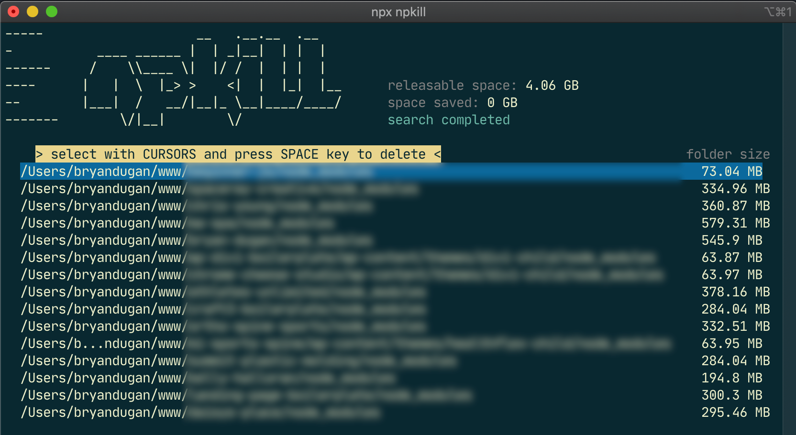

Here's a quick tip that I have discovered to save space on your local drive. There's a utility called [npkill](https://npkill.js.org/) that helps to remove old `node_modules` folders to help save space easily.

To use npkill, start by opening up a terminal window and navigating to your web projects directory. It's not recommended to search your entire computer as it may take a long time, and it will also show the required resources for other applications on your computer.

Navigate to your web projects folder

```bash
 cd www/
```

Run npkill by typing

```bash
npx npkill
```



From there, select a directory with the up/down arrows and delete a directory with the spacebar. I ended up saving a total of around 4GB of space the first time I ran the utility. Run this command periodically to remove unneeded `node_modules` folders on your projects.
