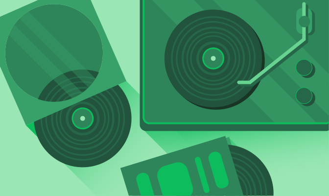
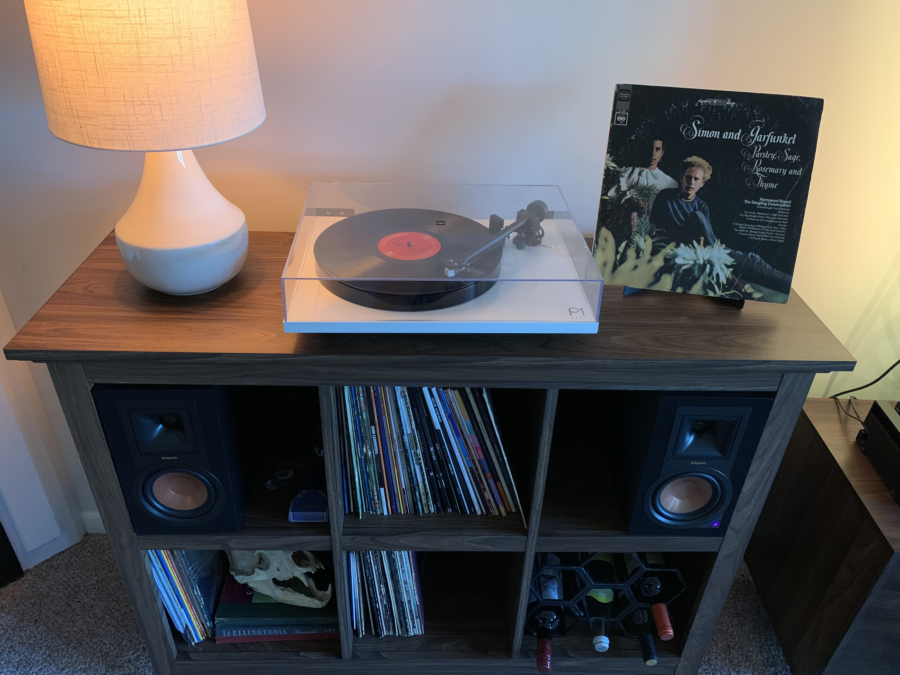

Every once in a while, I like to write about something that isn't design, or development-related that I'm passionate about. If you didn't already know, I enjoy stepping away from the digital world and "going analog" any chance I can get. One of the many ways I do that, is I collect and listen to vinyl records.

Recently, I inherited my parent's old vinyl collection which has been sitting in a basement untouched for around 30 years. A lot of them had a thick layer of dust on them since many weren't in sleeves and were left in the open. The collection needed a lot of love to get them restored to their old glory. When posting about the progress on Social Media, I've had a few people ask for pointers and tips. I thought it would be a great idea to write about that process and document for other people restoring their old collections.

## Cleaning Album Covers/Sleeves

I start by taking a [swifter duster](https://amzn.to/2ZG0dig) and dusting the heavy dirt/dust off each cover.

I then use a very slightly damp microfiber cloth with a few sprays of [Mrs. Meyers multi-surface cleaner](https://amzn.to/2zBF8uG) to wipe each album cover. I wanted to use something with no harsh chemicals. A simple cleaner to get some of the dust/mildew smell off of them. Once the cloth gets a bit dirty, swap it out for a fresh one. Also, be extremely careful not to scrub hard or make the cloth too wet, or else you risk taking the ink off the cover.

If a cover's bottom is completely worn down, I take some masking tape and place it on the bottom to close it back up. If you care about the color of the tape, Scotch has an "expressions" line with multiple colors to try and match with the album art. I keep a [black tape](https://amzn.to/36EM7iQ) and a default [beige](https://amzn.to/2X1OvNk) on hand.

Once each cover is done, it's time to take a look at all the sleeves. If the vinyl is missing a sleeve, or just has a plain sleeve, I instantly replace it with a [Big Fudge brand sleeve](https://amzn.to/31SkpLl). These sleeves work great and aren’t too expensive.

If the album has a custom sleeve, I wipe the sleeve, and keep the original sleeve in the case and place the record into a new sleeve.

## Cleaning vinyl - organized by how dirty/scratched each one is

There are different options for cleaning the vinyl, depending on how dirty or scratched it is. I have tried to cover the top three use cases. Deep gouges, medium scratches, and small scratches.

> Cleaning a scratched record won't get the scratches out, but it might help album playback and fix small skips.

### For cracks, deep gouges and a lot of deep scratches

Unfortunately, there isn't too much to do in this situation, a few of the records I got were just in too rough of shape and I ended up recycling these. It's not only near impossible to repair these. It's also likely you may also damage your player's needle or reduce its life dramatically if you attempt to play these. If you feel bad about letting these albums go, you can use these beat-up LP's to create [coasters](https://www.youtube.com/watch?v=P4EoCt5KVck) and other [neat things](https://www.youtube.com/watch?v=OifXWdkqc0Y).

### For medium-sized scratches and/or heavy dirt

If your album has some playback issues such as the occasional skip, you can give the following process a try for cleaner playback.

Start this process by cleaning the album regularly to get all the heavy dirt/grime off it. I use a generic distilled water spray, along with a microfiber cloth to clean the albums.

After cleaning the record, you can cover the record with a thin layer of wood glue. You heard that right, wood glue. Believe it or not, Wood Glue makes the perfect album cleaner. Use [Titebond 2 wood glue](https://amzn.to/3d6PFNd) and spread it over evenly using some spare card stock (avoid the label or use something to cover the label completely so it doesn't get damaged) and let it dry for a day or two. Once the glue is dried, peel off the glue. It should all be able to come off in one piece. Then, clean the album again with a distilled water based spray to get the last of the glue off, and it's good to go. This process is time-consuming, but well worth it if you get a few skips or if the album loops in places.

**Note:** I'd recommend picking up the wood glue at your local hardware store since I've noticed it to be a bit expensive online.

### For small-sized scratches and dust

A lot of the pieces of vinyl I was working with were caked in a thick layer of dust and needed a heavy cleaning. For the dust, I used distilled water, along with a microfiber cloth to get all the heavy stuff off of each record. I then used [Boundless Cleaning Solution solvent](https://www.amazon.com/gp/product/B07RRM3QWS/ref=ppx_yo_dt_b_asin_title_o01_s00?ie=UTF8&psc=1&fbclid=IwAR0eHbedaiysvirDQvCC68b4hG_-V1SsvXDCn2vR2MBSSFoMsrC0wTEAh9Q) to clean over them once again. Wait for the vinyl to dry completely before attempting to play it again.

### General cleaning before each play

It's important to clean both the stylus and do a quick once over of the vinyl before each play to remove any excess dust, especially if you’re playing an older album. Before playing any record in my collection, I give it a quick once over with the [Vinyl Buddy record cleaner](https://amzn.to/2X2dRe2). It does a wonderful job of picking up debris. However, after every few cleans, run it under water and scrub off any excess dirt with your hands. Then leave it in its case with the lid half-opened for it to dry. Make sure to clean the record cleaner about once a week with normal use, or you risk scratching your record.

For the stylus itself, I give it a quick brush with a [stylus cleaner brush](https://amzn.to/3ekID7G). When you play a record that hasn't been played in a long time, be sure to clean the stylus after. Even after playing a cleaned record, dust and debris will still be heavy in the Vinyl's grooves for the first few playbacks. So make sure to clean that stylus after each play-through. To clean the stylus, clean from the back, moving forwards. Otherwise, you could risk damaging the stylus. Here is a [quick video](https://www.youtube.com/watch?v=rvaz07Majog) that shows how to do it.

> Even after playing a cleaned record, dust and debris will still be heavy in the vinyl's grooves for the first few playbacks. So make sure to clean that stylus after each play-through.

---

There you have it! If you have any other vinyl restoration and maintenance tips, I'd love to hear about them. Shoot me an email, or message me on Twitter [@bryandugan](https://twitter.com/bryandugan)
