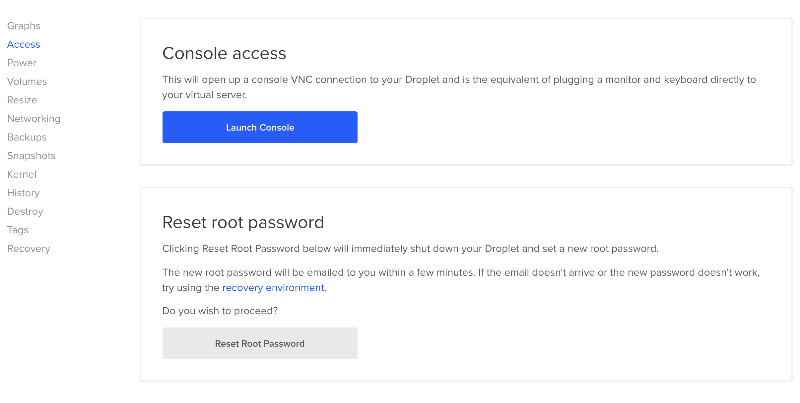
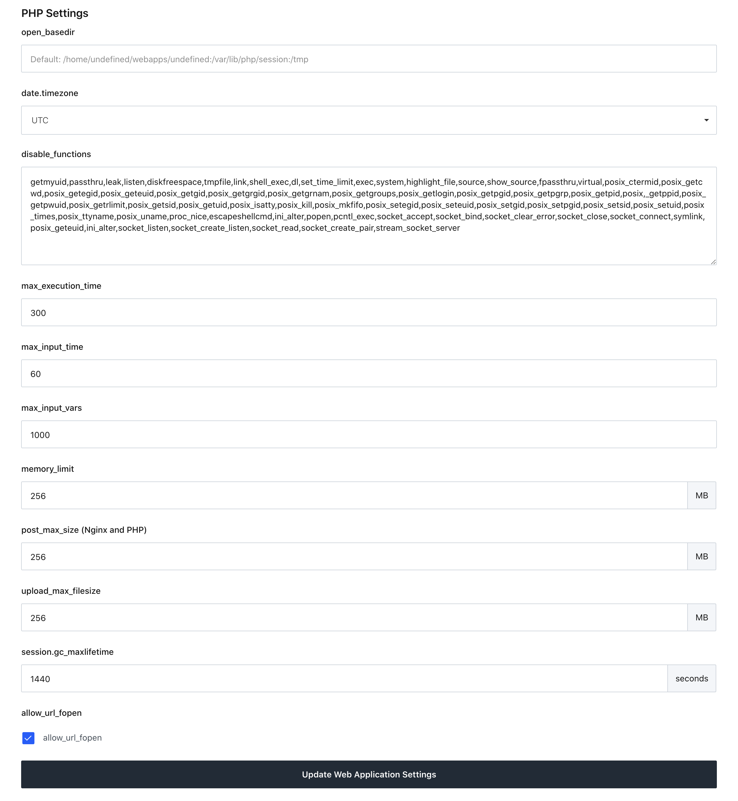
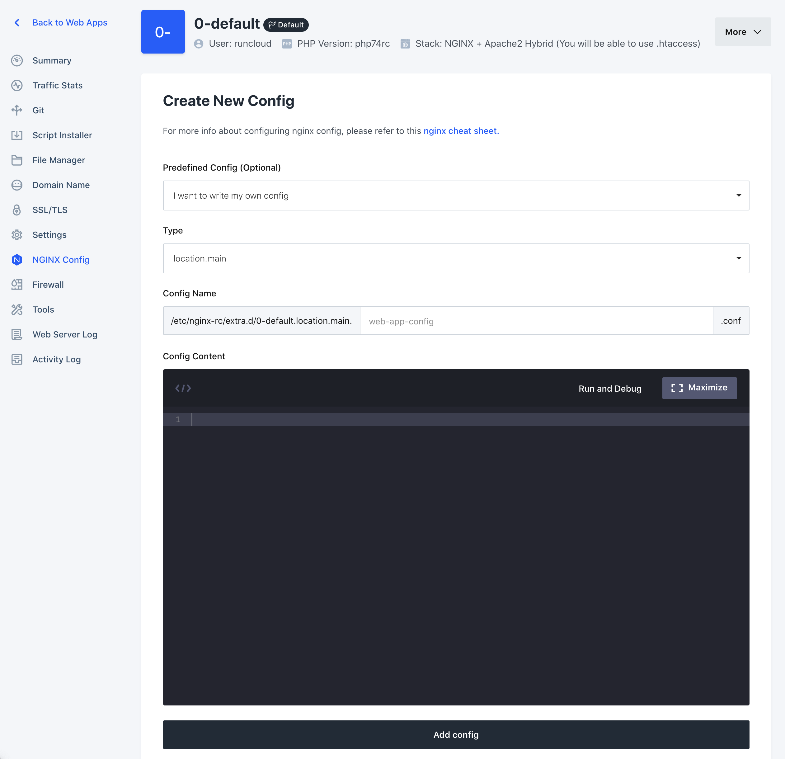
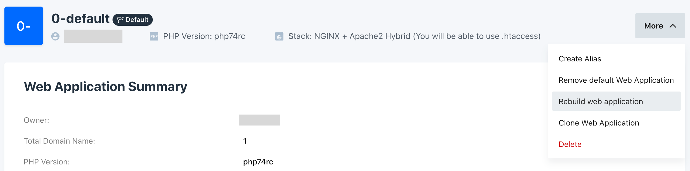

If you're setting up a Craft CMS website on [RunCloud](https://runcloud.io/r/ZMrWgZNDeyRw), here is everything you need to get started. For this setup, I am using a Digital Ocean server with Ubuntu 18.04.

## **Install packages/extensions**

Start by installing some required and optional packages to make the most out of your RunCloud Installation. During the time of this writing, all my applications on the server are running PHP 7.4 so this article is geared towards that. **You will need to install the extensions for every PHP version you're using**. For example, if you're running PHP 7.1 and 7.4, you would need to do something like `apt-get install php71rc-sodium php74rc-sodium` to install the sodium package for both versions of PHP. Also, be sure to run the restart command for each version so the changes can take effect. `systemctl restart php71rc-fpm php74rc-fpm`. Also take note, that RunCloud has its own version of PHP, so the naming convention of things is slightly different.

If you may need any additional packages, RunCloud offers some documentation on other common PHP modules you can obtain here: [https://runcloud.io/docs/guide/cheat-sheet/php#installing-modules](https://runcloud.io/docs/guide/cheat-sheet/php#installing-modules)

### Getting Started

Start by opening up a terminal window and SSH into your server as your root user.

```bash
ssh root@SERVER_IP_ADDRESS
```

**Note:** When I set up my Digital Ocean server through RunCloud UI, I was never sent an admin password. If you don't know your server's root password, never received one, you can reset it in Digital Ocean, by selecting your server, clicking the "access" tab, and selecting "reset root password".



### Sodium (Required)

Sodium is a required PHP extension that Craft CMS uses to handle encryption, decryption, password hashing, and more.

```bash
apt-get install php74rc-sodium
```

To get the changes to take place, restart PHP by running the following

```bash
systemctl restart php74rc-fpm
```

### Imagick (Preferred)

This is the preferred image rendering library for Craft CMS. It handles transforming images much better than the pre-installed module, GD, and is highly recommended for not only Craft but also WordPress and other popular CMS's.

```bash
apt-get install php74rc-pecl-imagick
```

To get the changes to take place, restart PHP by running the following

```bash
systemctl reload php74rc-fpm
```

### FFmpeg (Optional)

FFmpeg is an optional application that's used for compressing video files on the fly. Craft doesn't handle this natively, but you can use a plugin like [Transcoder](https://plugins.craftcms.com/transcoder) to serve compressed video files if you plan on using them regularly. To learn more about FFmpeg, you can view their documentation at [https://ffmpeg.org/](https://ffmpeg.org/) or this wonderful article on the [best practices for background videos](https://www.viget.com/articles/best-practices-for-background-videos/) by Viget.

```bash
apt-get update
apt-get install ffmpeg
```

Now that we have the two required extensions, let's move on to configuring your application's PHP settings.

## Configure PHP Settings within the RunCloud Dashboard

For each web application you create that uses Craft; Here are the settings I have applied to each application, based upon Craft's PHP system requirements. At this time, RunCloud doesn't have a way to create a template to quickly duplicate preferred PHP settings for each application, but I did put in a [feature request](https://features.runcloud.io/suggestions/93236/ability-to-create-php-settings-templates-in-admin-dashboard) so you don't have to go through these steps for each application.

To get to the PHP application settings in RunCloud, go to *Web Application → [App Name] → Settings*, then scroll down to PHP Settings.

### **open_basedir**

Remove the text in this field:

```
Default: /home/undefined/webapps/undefined:/var/lib/php/session:/tmp
```

**Note:** Keeping the default field info will fail Craft CMS updates on the production site.

### disable_functions

Remove the following functions from the list to enable them, as they are needed for Craft CMS to run properly. If your Craft site is having any issues with running or are getting multiple server errors while navigating the Admin panel, be sure to check these settings.

-   `proc_open` — Plugin Store operations and sending Emails.
-   `proc_close` — Plugin Store operations and sending Emails.
-   `proc_terminate` — Plugin Store operations and sending Emails.
-   `ignore_user_abort` — Native web-based queue runner.
-   `set_time_limit` — Optional function that Craft uses to limit max execution time.

### max_execution_time

Change `default max_execution_time` to 300.

**Note:** Craft requires a minimum PHP max execution of 120s.



## Edit NGINX config to redirect www to non-www

> Update Oct 2021: This step isn’t necessary with the updated Runcloud Dashboard. You can now update the redirects via the web interface under Web Apps > (application name) > Domain Name

When it comes to adding www or no www to a website, it all comes down to a matter of preference. I like all my traffic to go to the non-www version since it just feels like a cleaner URL. Either way, you'll want to set up all traffic to go to one version of the site, or else you may run into CORS, or SEO related issues while trying to serve up content.

To begin, go to your web application in the RunCloud dashboard and click on the NGINX Config tab on the left-hand navigation. Then click on Create Config to get started with creating your config file. From there, give the config any name that you would like, paste the rewrite you want to use, and save the config.

Redirect non-www to www

```bash
if ($host !~ ^www\.) {
  rewrite ^ $scheme://www.$host$request_uri permanent;
}
```

Redirect www to non-www

```bash
if ($host ~* ^www\.(.*)) {
	set $host_without_www $1;
  rewrite ^(.*) $scheme://$host_without_www$1 permanent;
}
```



## Rebuild the Application to apply changes

After adjusting anything in the settings panel, RunCloud recommends you to rebuild the application. To do this, click on the "More" button on the top right portion of the screen and select "Rebuild web application".



---

Your RunCloud server is now properly configured for Craft CMS! If you have any issues or additional input, feel free to get a hold of me on Twitter [@bryandugan](https://twitter.com/bryandugan)
