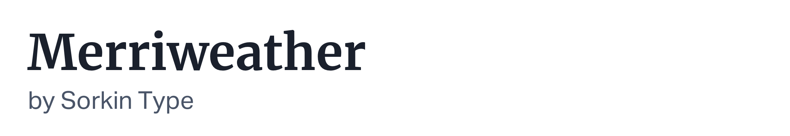

If you're looking for free commercial fonts for a web project, [Google Fonts](https://fonts.google.com/) is my go-to source. Choosing a great font helps set the overall tone for a website or application and makes it look more polished. Here are some of my favorite Google Fonts that I regularly use in my work.

## Headings

These headings, or otherwise known as display fonts, are great to use for headlines that will stand out at large sizes.

Playfair Display — [https://fonts.google.com/specimen/Playfair+Display](https://fonts.google.com/specimen/Playfair+Display)

Exo 2 — [https://fonts.google.com/specimen/Exo+2](https://fonts.google.com/specimen/Exo+2)

Rubik — [https://fonts.google.com/specimen/Rubik](https://fonts.google.com/specimen/Rubik)

## Body copy

Body copy should be legible while reading large blocks of text. Some of the fonts listed in this section could also work as a headline but may not be as effective.

Merriweather Sans — [https://fonts.google.com/specimen/Merriweather+Sans](https://fonts.google.com/specimen/Merriweather+Sans)

Merriweather — [https://fonts.google.com/specimen/Merriweather](https://fonts.google.com/specimen/Merriweather)

PT Sans — [https://fonts.google.com/specimen/PT+Sans](https://fonts.google.com/specimen/PT+Sans)

PT Serif — [https://fonts.google.com/specimen/PT+Serif](https://fonts.google.com/specimen/PT+Serif)

Libre Baskerville — [https://fonts.google.com/specimen/Libre+Baskerville](https://fonts.google.com/specimen/Libre+Baskerville)

Lora — [https://fonts.google.com/specimen/Lora](https://fonts.google.com/specimen/Lora)

Lato — [https://fonts.google.com/specimen/Lato](https://fonts.google.com/specimen/Lato)

## Multipurpose

These fonts are usually my go-to fonts as they not only look great at multiple sizes and weights but also complement each other perfectly. When in doubt, choosing one of these fonts is always a safe bet.

Inter — [https://fonts.google.com/specimen/Inter](https://fonts.google.com/specimen/Inter)

Montserrat — [https://fonts.google.com/specimen/Montserrat](https://fonts.google.com/specimen/Montserrat)

Libre Franklin — [https://fonts.google.com/specimen/Libre+Franklin](https://fonts.google.com/specimen/Libre+Franklin)

Work Sans — [https://fonts.google.com/specimen/Work+Sans](https://fonts.google.com/specimen/Work+Sans)

Poppins — [https://fonts.google.com/specimen/Poppins](https://fonts.google.com/specimen/Poppins)

## Selecting fonts yourself

If you're looking to select fonts for yourself on Google Fonts, here are some tips to quickly filter and find great neutral fonts to use for your website or web-app:

1. Under Categories, select "Sans Serif." Sans Serif fonts are most commonly used in web applications. If you're looking for something for a general marketing site, feel free to select Serif as well.
2. Under "Font properties" > "Number of styles" select "10+". A font with more styles is usually more thought out and complete. You may also pick multiple weights or styles as needed.
3. Lastly, in the sorting options select "Most popular" instead of "Trending." Trending fonts are newer fonts on the rise, whereas "Most popular" are the most used.
4. When looking at a font, be sure to read the about section of that font. It usually gives details as to what the fonts best used for and sometimes some good font pairings.
