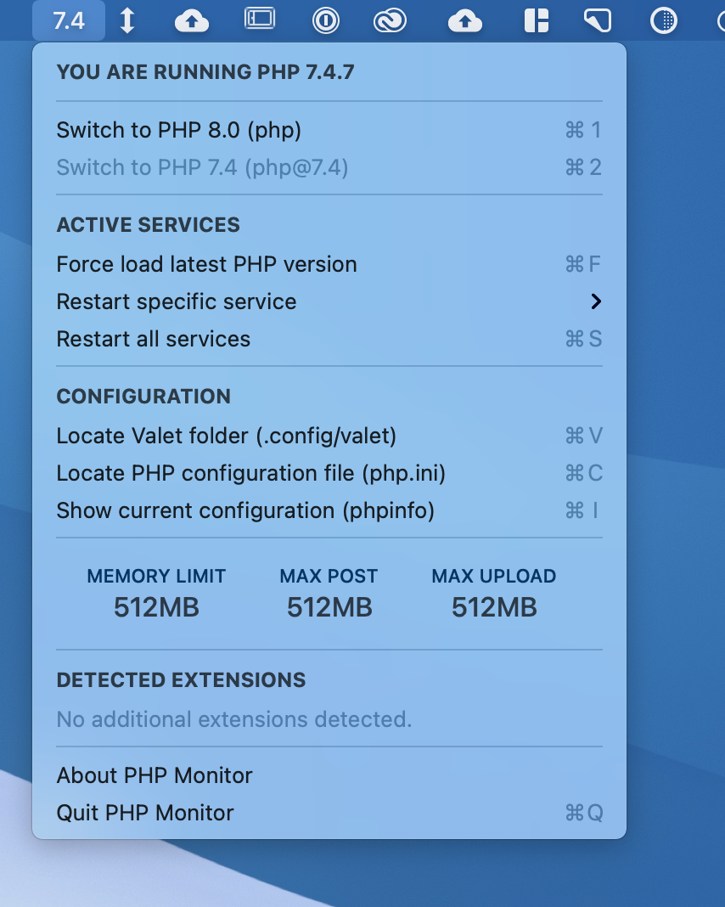

Need to update PHP for use with your local development stack? This short guide will run you through how to do just that, as well as upgrading your PHP version in Laravel Valet.

## Upgrading PHP with Homebrew

Assuming you already have Homebrew installed

Update Brew.

```bash
brew update
```

Install the latest version of PHP.

```bash
brew install php
```

Alternatively, if you're looking to use a specific version to match your production server version you can add @ then the version number to the end of the formula. So if you wanted to install PHP 7.3, you would use the following command.

```bash
brew install php@7.3
```

Check which version of PHP you're currently running by using `php -v`.

```bash
php -v

PHP 7.1.30 (cli) (built: Jun 17 2019 08:52:19) ( NTS )
Copyright (c) 1997-2018 The PHP Group
Zend Engine v3.1.0, Copyright (c) 1998-2018 Zend Technologies
with Zend OPcache v7.1.30, Copyright (c) 1999-2018, by Zend Technologies`
```

Unlink your old PHP version from brew by typing the old PHP version minus the minor update number. (In this example's case we are using PHP `7.1.30`, so we would use PHP `7.1`)

```bash
brew unlink php@7.1
```

**Note:** PHP went through a formula update in 2018 where `php71` is now `php@7.1` so be sure to try both ways if you're running into issues.

Link your new PHP version.

```bash
brew link php@7.3
```

**Note:** Replace `7.3` with whatever version of PHP you want to switch to or remove `@7.3` completely if you just ran `brew install php`

---

## Updating Your \$PATH

Now that your PHP is updated and linked, make sure your `$PATH` is properly setup.

Open `~/.bash_profile` in your favorite text editor and add the following: (Replace PHP 7.3.7 with whatever version of PHP you're using)

```bash
# Setting PATH for PHP 7.3
export PATH="/usr/local/opt/php@7.3.7/bin:$PATH"
export PATH="/usr/local/opt/php@7.3.7/sbin:$PATH"
```

**Note**: After modifying your `.bash_profile` you must fully close out of your terminal and re-launch it for your changes to take effect. Alternatively, you can type `source ~/.bash_profile` in your terminal for the changes to take effect.

---

## Adding PHP Packages

Homebrew now uses PECL for all PHP packages, you may need to reinstall any packages that were previously managed with Homebrew.

To find out if you're already using PECL packages type the following command in your terminal to list out any packages that you may have installed.

```bash
pecl list
```

Install your PECL packages. Imagick is the only one I use, which handles image transformations in Craft CMS. To install it, run the following command

```bash
pecl install imagick
```

**Note:** To to see a list of all PECL packages, refer to [https://pecl.php.net/](https://pecl.php.net/)

---

## Configure PHP Settings

In order to figure out where your php.ini settings are located, run the following command in your terminal.

```bash
php --ini
```

PHP in Homebrew by default adds a file called `php-memory-limits.ini` which is in the following location. This will overwrite the settings in the default php.ini and make it easier to move over to a new installation in the future.

```bash
Configuration File (php.ini) Path: /usr/local/etc/php/7.3
Loaded Configuration File:         /usr/local/etc/php/7.3/php.ini
Scan for additional .ini files in: /usr/local/etc/php/7.3/conf.d
Additional .ini files parsed:      /usr/local/etc/php/7.3/conf.d/ext-opcache.ini,
/usr/local/etc/php/7.3/conf.d/php-memory-limits.ini
```

Modify your php-memory-limits.ini file and move over your settings. Below is a list of my personal config file.

```php
; Max memory per instance
memory_limit = 1024M

;Set the max ececution time of a script.
max_execution_time = 300

;The maximum size of an uploaded file.
upload_max_filesize = 128M

;Sets max size of post data allowed. This setting also affects file upload. To upload large files, this value must be larger than upload_max_filesize
post_max_size = 128M
```

## Upgrading Valet

**Update:** There's also a handy utility called PHP Monitor that allows you to see PHP information, switch between versions and allows you to quickly modify your php.ini files.



If you use Laravel Valet for all your local development, here are the steps to finish upgrading PHP. Run the following commands to update Valet in your terminal:

Update all composer files.

```bash
composer global update
```

Run the install script for Valet.

```bash
valet install
```

Restart Valet by running the restart script.

```bash
valet restart
```
