Working with uncompressed videos on a production server can cause many issues such as running out of disk space quickly, and loading or encoding videos will take a long time. Before placing any video content on a production server, I highly recommend optimizing it first, even if the production server optimizes the video. Doing so will significantly reduce the load on the server.

> **Note:** This tutorial is geared towards users who use a plugin such as the Transcoder plugin for Craft CMS and need to optimize it before letting the server re-compress the video.

[HandBrake](https://handbrake.fr/) is an easy to use, open-source (free) application for all major platforms that allows you to compress videos to lower the file size significantly and enable them to load quickly. I recommend running HandBrake on any video file set as a background visual in a ~15s maximum loop. If the video is an informational piece, use a third-party source such as YouTube or Vimeo to host the video.

## Getting started

Download HandBrake from [https://handbrake.fr/](https://handbrake.fr/)

## Setting up a video preset

Creating a video preset is something you'll only need to do once. Once completed, you'll be able to select the preset and quickly render the video using the instructions in the next section, "General usage."

**1.)** Once you open HandBrake, start by selecting the video file in which you would like to compress.

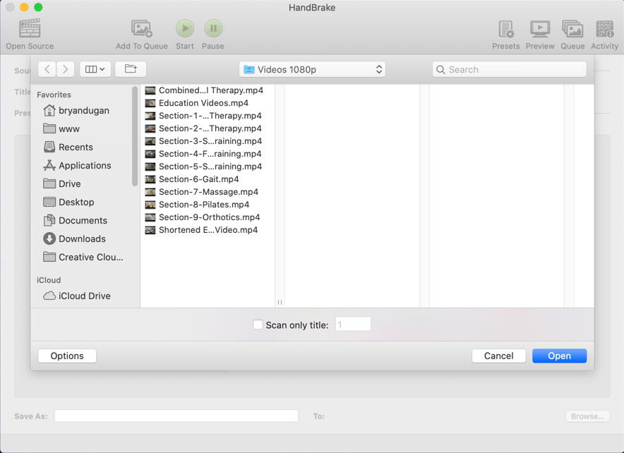

**2.)** From the dropdown, select Fast 1080p30 as a starting point for our new preset.

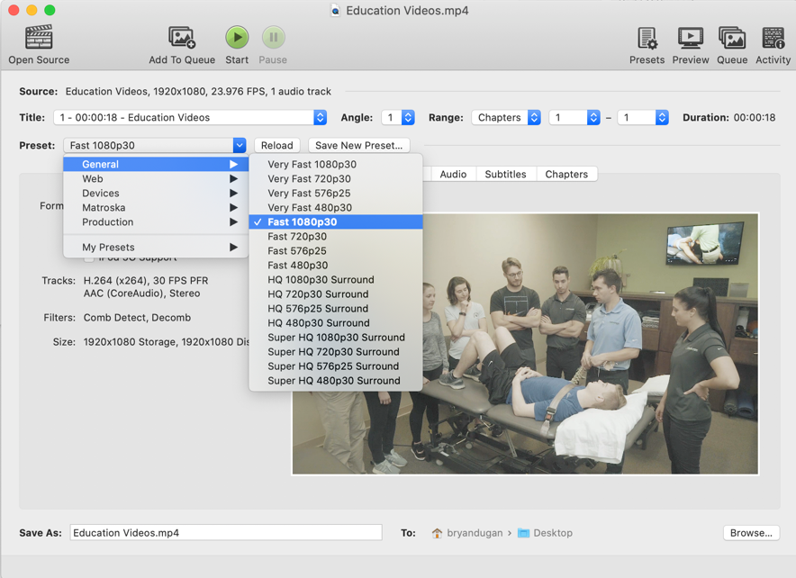

**3.)** Select Web Optimized.

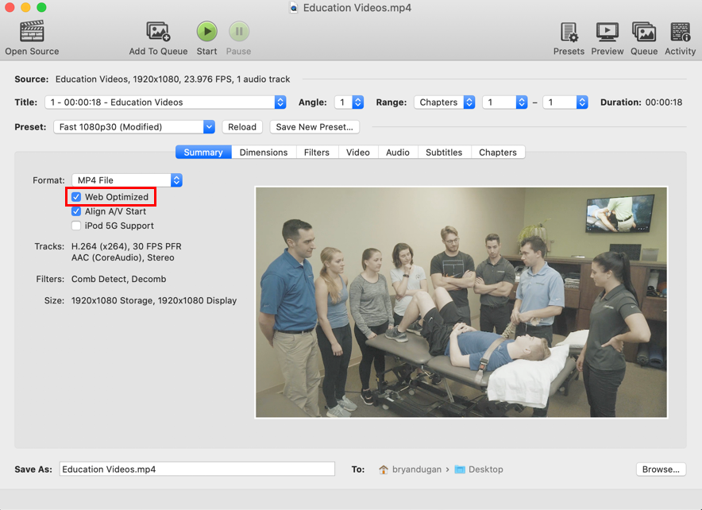

**4.)** Click on the Audio Tab.

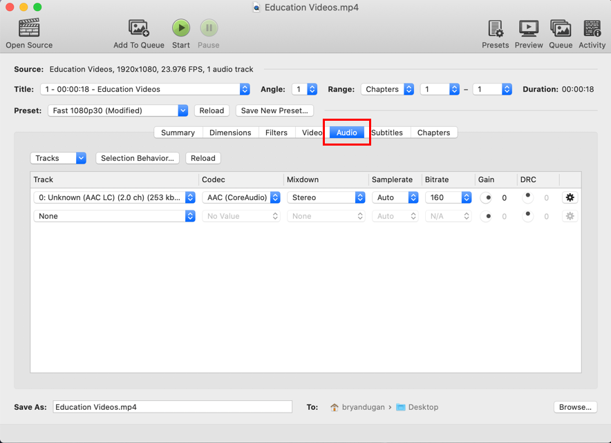

**5.)** Select None from Track. For background videos, completely removing the audio track will help significantly reduce the file size, even if it already doesn't have sound.

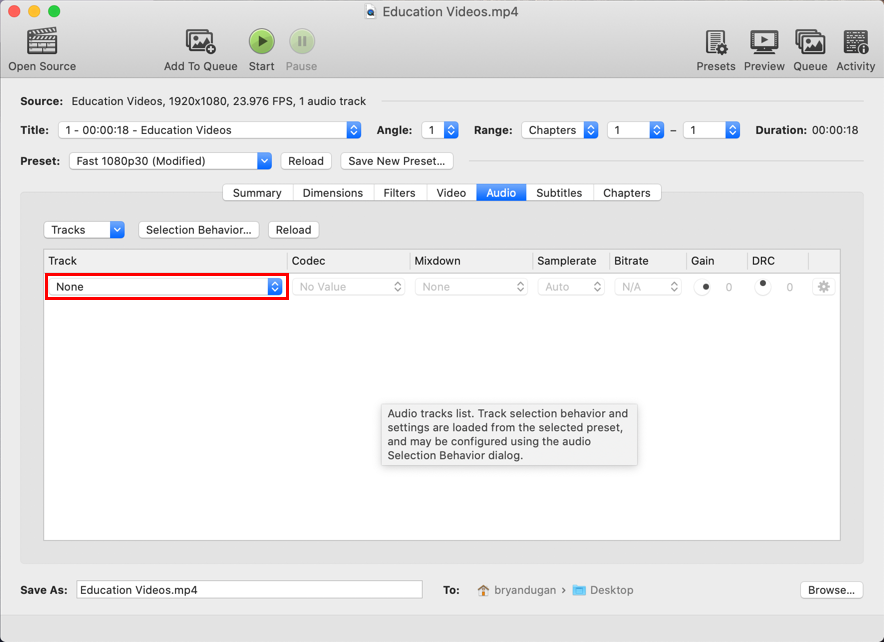

6.) Click "Save New Preset..."

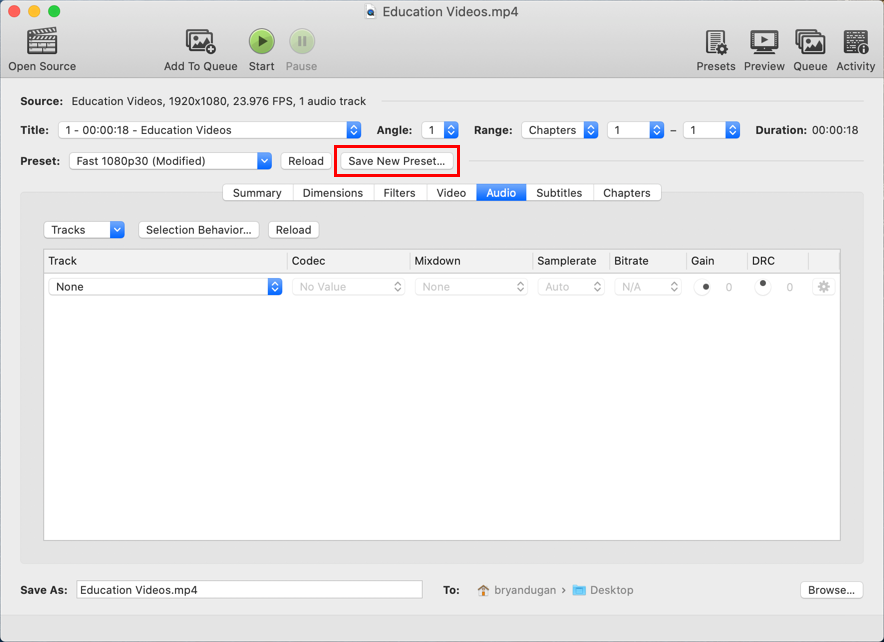

**7.)** Give the preset a name ex.) 1080p web. Then click "Add."

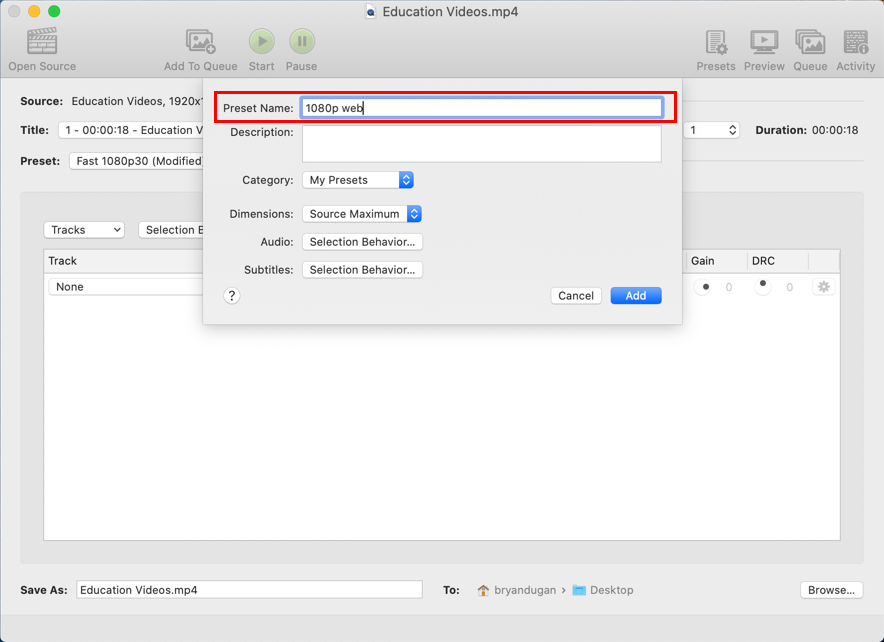

## General usage

After setting up your preset, use these general steps to render out each video.

**1.)** Go to `Preset > My Presets` and select your preset.

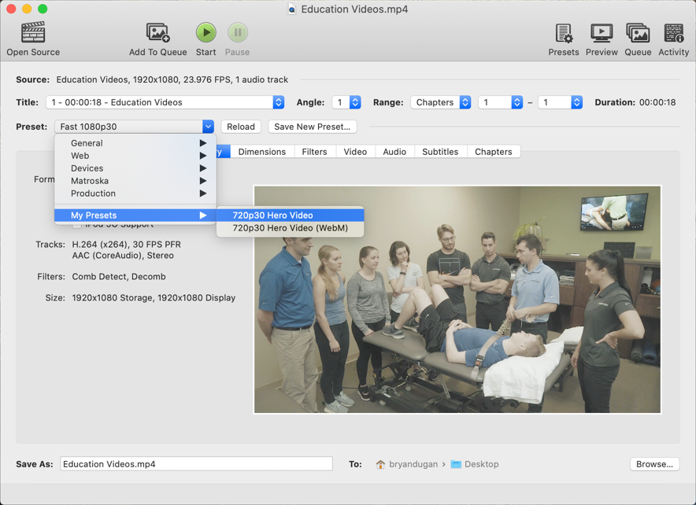

**2.)** At the bottom, select a `Save As:` destination to where you would like your video to be saved..

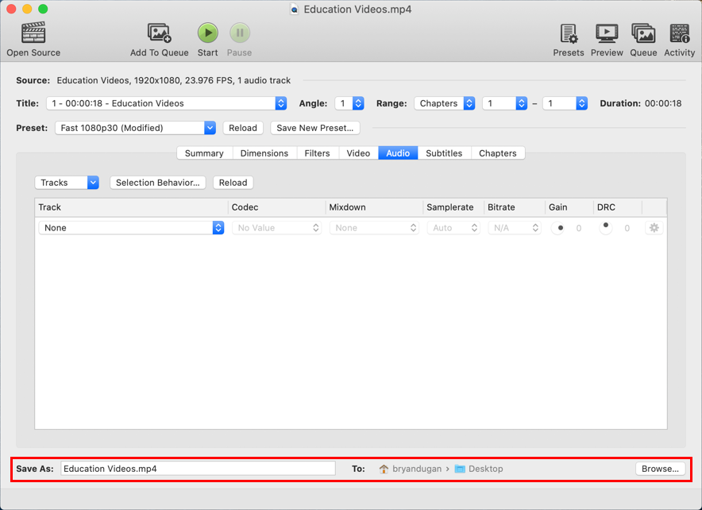

**3.)** To render your video, select the `Start` button at the top. Your video will be saved to your save destination.

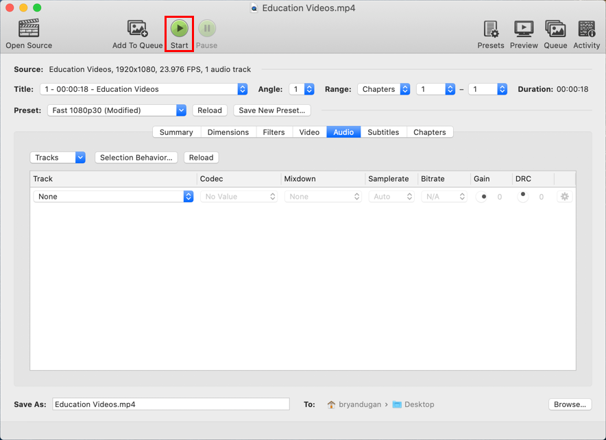

**4.)** Once the video is finished rendering, right-click on the new video file and click "Get Info." Check the file size and make sure it's ~10MB or a maximum of 100MB before uploading the video. If it's larger than 100MB, try shortening the video length, or export it at a 720p web-optimized preset instead.

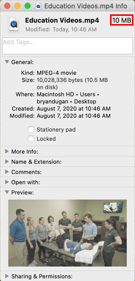

## Uploading to Craft CMS

While uploading the newly rendered video to the CMS, Transcoder will not generate the video until a user visits the page with the video for the first time. Be patient while the server is rendering. It's doing a lot of work creating an image thumbnail of the video, then rendering the video as a .mp4 and .webp to be compatible with all major browsers.
